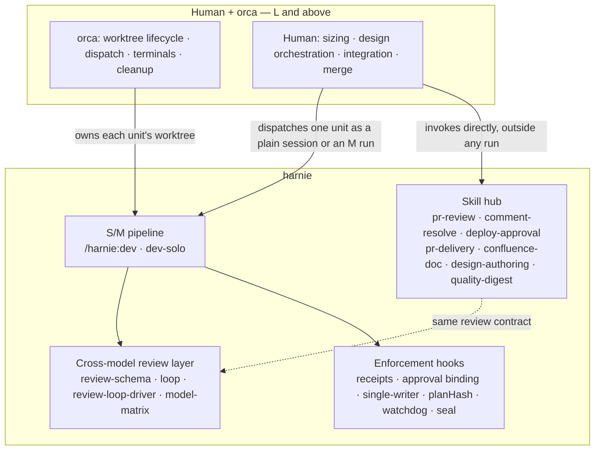

# harnie 0.13 — Deleting the L pipeline (rev-1)

> Altitude: architecture. Status: **design, for approval**. No code or skill file is modified by this document.
> Supersedes `design-0.13-L-dismantle-draft.md` (rev-0), which recommended *freeze + assembly guide* and is deleted in the same commit as this file (git history is the recovery path).
> Decision basis: the 2026-08-27 user decision that **L-sized development belongs to human + orca**, which raised rev-0's recommendation from freeze to **delete**. Cross-model design review (Codex `gpt-5.6-sol`) ran one round against this revision; the record is §11.
> Measurements in this document were taken on the `h013-u2` worktree at `main` (`f98898b`), where `node --test scripts/*.test.mjs hooks/*.test.mjs` = 304 pass / 0 fail.

---

## 1. Executive summary

**Delete harnie's L pipeline outright in 0.13 — the execution layer, the design layer above it, and the engine subsystems that exist only to serve it.** What remains is the framing confirmed on 2026-08-27: ① a cross-model quality/evidence layer, ② development automation at size M and below, ③ a skill hub.

Four decisions carry the design.

1. **Delete, not freeze.** Freeze's only justification was the hedge "harnie might own L again later." That hedge is gone by user decision, and freezing still forces the same contract migration as deletion (§3-F3) while adding maintenance of an unreachable path.
2. **errata v2 is deleted outright, not made run-local.** The DR round-1 blocking ③ is confirmed by measurement: errata is wired into the **M** completion and DR-hash contracts, not just L (§3-F3). Its stated reason to exist — a central manifest frozen while N runners execute — has no counterpart in M, which has one task and one owner session, and whose post-approval design changes already route through the A5.2 re-approval path (`skills/dev/SKILL.md:42`). Deleting it means unwiring the M path, and §6 is the row-by-row plan for that.
3. **Workspace (multi-repo) mode is deleted because L is its only entrance.** `skills/dev/SKILL.md:12` states it as a contract: *"A workspace run (multi-repo) is always L."* With L gone, no path can reach it (§3-F4).
4. **rev-0's §5.2 unit-evidence contract is deleted, not strengthened.** DR round-1 blocking ④ was correct *about rev-0*: a document-only check could let a STALLED unit's branch be merged into a tree that harnie would then declare COMPLETE. Under delete, harnie no longer merges anything and no longer emits a completion verdict over a multi-unit composition — the false-COMPLETE path is removed by removing the claim, not by adding a mechanism (§7).

**Largest risks.** ① The migration touches shared engine code (completion derivation, the one-shot arm mutual-exclusion set, `rebind-task` reasons), so a mistake degrades **M**, the path that is actually used — mitigated by §6's per-row verification tests and the fact that L itself has zero execution history to regress. ② Removing errata removes the only in-run channel for recording an approved-design defect in M; the replacement is A5.2 re-approval, which is more expensive per event but has never been measured in M. ③ Documentation drift: 198 `errata` references and ~82 workspace-mode references span code, tests, instructions, agents, and README (§5).

---

## 2. Goals, scope, non-goals, constraints

**Goals.** Remove every L-only surface from harnie. Leave the S/M pipeline working, with exactly three deliberate behavioural changes: errata is gone, workspace mode is gone, and the `harness-digest` skill is retired by the 2026-08-27 decision (D1). Leave the repository self-consistent: no dangling reference to a deleted file, contract, or CLI verb.

**Success criteria.** ① `node --test scripts/*.test.mjs hooks/*.test.mjs` passes with the deleted subsystems' tests removed and the migrated contracts' tests updated. ② `rg` for each deleted symbol (`errata`, `repo-add`, `memberWorkroots`, `ws:`, `harnie-task-runner`, `stages/large`, `design-authoring-contract`, `harness-digest`, `--archive-to`) returns hits only in `docs/` history documents — **the sweep excludes surviving `*-ko.md` mirrors**, which retain stale references by language policy; for the deleted English files, the separate check is that their `-ko` pairs are absent. ③ An S run and an M run still complete end to end.

**Scope.** `skills/dev/stages/large.md`, `agents/harnie-task-runner.md`, `instructions/design-authoring-contract.md`, `skills/harness-digest/`, errata v2, workspace mode, `worktree.mjs` merge/archive, the `L` value of `mode`, and every reference to those in registration, instructions, agents, tests, and README — plus the `-ko.md` pair of each **deleted** English file.

**Non-goals.** Rewriting M or S. Rewriting the cross-model review loop. Building any replacement for L inside harnie — dispatch, worktree lifecycle, and integration are orca's and the human's. Compressing documents or reducing engine bureaucracy beyond the orphans this deletion creates (that is U3, whose denominator this work changes). Touching `*-ko.md` mirrors of files that survive (per the 2026-08-27 language policy, mirrors are refreshed only on explicit human request).

**Constraints.** Deletion-only for engine subsystems: no new CLI verb, no new state file, no new mode. Enforcement confirmed as keep — receipt binding, approval one-shot binding, single-writer attribution, `planHash`, watchdog — is not touched except where a deleted subsystem was one of its inputs.

---

## 3. Grounding — measured

### F1. The L path has never executed, at any version

`design-0.11-process.md` §2 NFR-4② made an L-path E2E a release gate and left it open as **[undecided U-4]**; no target was ever chosen. The fcl-hmm run that grounded 0.11 was a 0.10 run and executed **entirely serially** on a shared worktree (`design-0.10-restructure.md` §11.6). So deletion breaks no observed usage, and the counter-argument that rev-0 weighed heaviest — "you are replacing something unmeasured with something else unmeasured" — no longer applies, because 0.13 replaces L with **nothing inside harnie**.

### F2. The enforcement boundary — corrected from rev-0

rev-0 asserted that a central ledger with native parallel execution is *impossible* because a run has a single owner session. **That is not what the code says**, and DR round-1 blocking ① is accepted: `sentinel.sessionIds` is a **growable owner set**. `resumeRun` (`scripts/execution.mjs:645–659`) adds the current session to it — `next = owner ? (prev.includes(owner) ? prev : [...prev, owner]) : prev` at `:652` — and `isOwnerSession` (`hooks/lib.mjs:112`) tests membership, under the comment at `:107`: *"Every session that entered or resumed the run remains an owner until completion."* Multiple owner sessions under one run are a supported shape.

The narrower statement that survives is about **physical location**, not session count: `resolveRoot` (`hooks/lib.mjs:93`) starts at `findRoot(cwd)`, which stops at the nearest `.harnie/active.json` or `.git`, and `bootstrap.mjs:132` writes a session binding only when the session's cwd already sits at (or under) the central root. A session started in a *separate physical worktree* therefore resolves to that worktree, not to the central run. So multi-owner works **for sessions sharing one directory**; parallel builders in isolated worktrees under one central ledger would need a cwd-independent binding that does not exist today.

**Why this no longer decides anything.** In rev-0 this fact was load-bearing — it was the argument for "one unit = one M run". Under delete, harnie does not schedule units at all, so the shape of a hypothetical central ledger is out of scope. It is recorded here only because rev-0 stated it wrongly and §6 must not inherit the error.

### F3. errata v2 is not L-only — measured (DR round-1 blocking ③, confirmed)

| Evidence | Location |
|---|---|
| `computeCompletion` returns early only for `mode === "S"`; **every** manifest run (M included) then reaches the errata loop that pushes completion blockers | `scripts/execution.mjs:535` (S early return), `:569–574` (errata loop). No `mode === "L"` guard exists anywhere in the path |
| M's post-approval design-review hash contract names an errata cursor: *"design content ‖ planHash ‖ `m-plan` ‖ errata cursor"* | `skills/dev/SKILL.md:49`, restated in `instructions/review-loop-driver.md:41` |
| The run-wide one-shot arm mutual-exclusion set (type-agnostic) includes errata alongside approval and rebind | `scripts/execution.mjs:759–763` (`ONE_SHOT_ARM_FILES`, errata pair at `:761`), consumed by `otherArmPending` `:764` |
| `rebind-task`'s reason grammar mixes an errata-only alternative with two non-errata ones | `scripts/execution.mjs:1151–1157` (`correction:E-NNN` ‖ `finding:<unit>:CR-NNN` ‖ `verification:integration`) |
| Hooks bind the errata approval one-shot for owner sessions | `hooks/pretooluse.mjs:103`, `hooks/posttooluse.mjs:33` |
| errata control files are in both control-basename deny lists | `scripts/guards.mjs:6–7`, `scripts/loop.mjs:63` |

**Verdict:** removing the errata *files* alone would break M's completion derivation and leave M's DR-hash contract citing an input that no longer exists. §6 is written as a migration matrix for exactly this reason.

### F4. Workspace mode's only entrance is L

`skills/dev/SKILL.md:12`: *"A workspace run (multi-repo) is always L — S/M assume a single git tree and completion fail-closes otherwise."* `computeCompletion`'s S branch enforces the second half (`execution.mjs:539`: *"S mode는 단일 repo 전용"*). With `L` removed from the mode set (`execution.mjs:210`), a workspace run is unreachable — which is why §6 disposes of it as **delete**, correcting rev-0's "keep (relocated)".

### F5. `worktree.mjs merge` and `remove --archive-to` have exactly one caller

`rg` across all non-doc files: the only invocation of either is `skills/dev/stages/large.md:14` (L's sequential integration step). `worktree.mjs create` is **not** in this class — it is called by `hooks/bootstrap.mjs:25` and `scripts/execution.mjs:9` for the per-run worktree, and stays. rev-0 kept merge/archive on the grounds that a harnie-owned integration run needs them; under delete there is no integration run.

### F6. Per-task worktrees have exactly two creators, both L-only

`<workroot>/.harnie-wt/harnie-<slug>-t<id>` is created by the runner's step 1 (`agents/harnie-task-runner.md:12`) and, on the solo path, by dev-solo's L branch, which explicitly follows it (`skills/dev-solo/SKILL.md:19`: *"each in its own worktree (create it per task like the runner's step 1)"*). Both are deleted here (D2, D5). `registerBuilderAuto`'s worktree→task mapping (`execution.mjs:905–915`) and its `existsSync(serialWorktree)` guard (`:961`) exist to serve that shape; M's builder runs in the run root and is attributed through the `directRoot` branch.

### F7. Headless cannot be an execution unit (unchanged, still true)

`claude -p` does not load MCP servers, and the Codex builder is an MCP tool, so a headless unit cannot build. Recorded because it removes the last argument for keeping the runner path as a legacy option: unattended L automation was never available.

---

## 4. Alternatives considered

| | **A. Delete (adopted)** | **B. Freeze + deprecate (rev-0)** | **C. Keep and finally run the U-4 E2E** |
|---|---|---|---|
| Content | Remove the L surface and its L-only engine subsystems | Stop routing to L, keep files marked DEPRECATED | Keep L; perform one real L E2E to close U-4 |
| Contract migration required | Yes (§6) | **Yes — the same work** (F3: errata is wired into M either way) | No |
| Ongoing cost | None | Maintaining an unreachable path, its tests, and its mirrors | Full L maintenance + finding a large real job |
| Fits "L belongs to human + orca" | ✓ | △ leaves an unrouted implementation in the tree | ✗ |
| Fits "overengineering is a defect" | ✓ | △ keeps machinery with zero users | ✗ |
| Reversal cost | git history | low | — |
| Residual risk | Migration touches shared code used by M (§10 R1) | Same risk, deferred, plus drift between docs and an unrouted path | An unvalidated layer keeps receiving traffic |

**B was rev-0's recommendation and is rejected here**, because its one advantage — deferring risky work — is illusory: F3 shows the contract migration is owed under either option, so freeze pays the same principal and adds interest. C is out of scope: the 2026-08-27 decision assigned L to human + orca, so validating harnie's L has no consumer.

---

## 5. Deletion inventory — measured

**Files deleted outright** (English canon + its `-ko.md` pair; sizes in bytes as measured):

| File | English | `-ko` |
|---|---|---|
| `skills/dev/stages/large.md` | 7,979 | 8,914 |
| `agents/harnie-task-runner.md` | 5,970 | 7,068 |
| `instructions/design-authoring-contract.md` | 2,480 | 2,612 |
| `skills/harness-digest/SKILL.md` | 3,817 | 4,027 |
| **Total** | **20,246** | **22,621** |

≈ 41.9 KiB of documents removed, plus `docs/design-0.13-L-dismantle-draft.md` and its `-ko` pair (rev-0, superseded by this file).

**Code and test surface**, by `rg -c` hit count per file (case-insensitive on the term, so hits ≥ symbols):

| Subsystem | Engine/hooks | Tests |
|---|---|---|
| `errata` | `execution.mjs` 55 · `loop.mjs` 2 · `guards.mjs` 2 · `pretooluse.mjs` 2 · `posttooluse.mjs` 2 | `execution.test.mjs` 38 · `hooks.test.mjs` 7 · `guards.test.mjs` 1 |
| workspace mode (`repo-add`/`memberWorkroots`/`workspaceRoot`/`ws:`) | `execution.mjs` 36 · `bootstrap.mjs` 11 · `loop.mjs` 5 · `pretooluse.mjs` 4 · `worktree.mjs` 1 · `delta.mjs` 1 (+ `guards.mjs` member-root params at `:126, :158, :186, :208`) | `execution.test.mjs` 14 · `loop.test.mjs` 4 · `bootstrap.test.mjs` 3 (incl. the resume case at `:197`) · `hooks.test.mjs` 2 · `worktree.test.mjs` 1 · `delta.test.mjs` `:6, :55–68` (`captureWorkspaceTree`) |
| `worktree.mjs` merge/archive | `mergeWorktree` 102–114 · `archiveTarget` 115–140 · the `archiveTo` branch in `removeWorktree` 148–172 + its rollback 199–202 · `cmdMerge` 230–236 · CLI case 247 — ≈75 of 251 lines | `worktree.test.mjs`: 8 named tests (`:98, :112, :130, :161, :174, :192, :203, :291`) |
| mode `L` in the engine | `execution.mjs:133` (M‖L integrationVerification), `:167–171` (L gate rule), `:210` (`S`/`M`/`L` accepted set), `:195` (`MODE_ORDER`) | `execution.test.mjs:1167, :1380` |
| per-task worktree mapping (F6) | `execution.mjs:525, :911, :961` · `guards.mjs:187, :218` (`taskWorktreeExists`) | `execution.test.mjs:526` · `guards.test.mjs:188–191` |

**Registration and prose references** (each must be edited, not merely deleted): `.claude-plugin/plugin.json:13`; `commands/dev.md:8, :12`; `skills/dev/SKILL.md:3, :10, :12, :16, :17, :25, :27, :32, :40, :49`; `skills/dev-solo/SKILL.md:10, :19`; `instructions/model-matrix.md:7, :8, :9, :13, :18, :24, :33, :34, :35, :41, :43`; `instructions/review-loop-driver.md:5, :27, :41, :44`; `instructions/design-review.md:10, :11`; `instructions/design-authoring-detail.md:3, :7, :11`; `instructions/loop.md:39, :48`; `skills/design-authoring/SKILL.md:17`; `instructions/team-collab.md:11, :20, :25`; `agents/harnie-designer.md:14, :17, :30, :35`; `agents/harnie-reviewer.md:38`; `README.md:36, :45, :72, :74, :95, :123, :124`; `docs/enforcement-map.md:13, :17, :18, :19, :26`; `docs/architecture.md:31, :106, :110, :117, :119, :125–131, :158`; `AGENTS.md:3` and `CLAUDE.md:3` (mirror pair — both, always).

---

## 6. Contract migration matrix

The core deliverable. Each row: **what is deleted → what contract remains on the S/M path → the migration action → the test that proves it.** Rows are ordered by risk to M.

| # | Deleted | Contract remaining on S/M | Migration action | Verification |
|---|---|---|---|---|
| **E1** | errata blockers in completion derivation (`execution.mjs:569–574`) | M/S completion stays: manifest derivation + `integrationVerification` receipt binding (`:551–567`) + the S tree binding (`:535–549`) | Delete the loop and the `listErrata` import path in `computeCompletion`. No other completion input changes | Existing M completion tests must still pass; add one asserting an M run with no manifest errata section completes (guards against a stale reference) |
| **E2** | The errata cursor in M's post-approval `dr:` hash | The hash still binds design approval to authority: `design content ‖ planHash ‖ m-plan` | Edit `skills/dev/SKILL.md:49` and `instructions/review-loop-driver.md:41` in lockstep to drop the errata term (and, from `:41`, the L-runner brief-edition and dev-solo `contract-rev-N` tokens — both are L-only). `loop.mjs:298` validates only the `dr:<sha256>` **form**, so no engine change is needed | Document contract; no engine test. Confirm by `rg 'errata cursor'` returning zero hits. **Consequence to state in the docs**: approved-design revision no longer invalidates a stale M design approval through errata — `planHash` re-approval (A5.2) remains the only invalidator, which is correct because errata was the only other mutation channel |
| **E3** | errata CLI verbs `errata-add` / `errata-arm` / `errata-set-disposition` / `errata-list` and their implementations (`execution.mjs:1029–1149`, dispatch `:1543–1559, :1633–1636`) | The A5.2 re-approval path for post-approval design change (`skills/dev/SKILL.md:42`: fix the block, re-arm, re-ask) | Delete the functions, the two severity/disposition sets, `errataPath`/`appendErrata`, and the four CLI cases | `execution.test.mjs:647, :661, :676` are deleted with the feature; an unknown-subcommand assertion covers the CLI surface |
| **E4** | errata's slots in the **run-wide one-shot arm mutual exclusion** (`execution.mjs:759–763`) | The invariant itself — *at most one arm/pending run-wide, type-agnostic* — is kept, now spanning approval and rebind only | Remove `.arm-errata.json` / `.pending-errata.json` from `otherArmPending`'s basename list. Do **not** weaken the check | `execution.test.mjs:688, :700` currently prove approval↔errata exclusion; rewrite as **one** test proving approval↔rebind exclusion, so the invariant keeps a test after its third type is gone |
| **E5** | `rebind-task`'s `correction:E-NNN` reason alternative (`execution.mjs:1151–1157`) | `finding:<reviewUnit>:CR-NNN` and `verification:integration` reasons, the `pendingRunRootBootstrap` marker, and the `--cancel approved-artifact:<sha>` path — all non-errata and all reachable from M | Narrow the regex to the two surviving alternatives; update the adjacent comment | Existing `rebind-task` reason-format tests, with the `correction:` case replaced by an assertion that it is now rejected |
| **E6** | errata hook wiring (`pretooluse.mjs:103` `recordPendingErrata`, `posttooluse.mjs:33` `bindErrata`) and control-file entries (`guards.mjs:6–7`, `loop.mjs:63`) | Approval and rebind one-shot binding; every other control basename in both deny lists | Delete the two hook call sites and the three basenames (`.pending-errata.json`, `.arm-errata.json`, `errata.md`) from each list | `hooks.test.mjs:298` deleted with the feature; the surviving control-file deny tests in `guards.test.mjs` must still pass unchanged |
| **E7** | errata in reviewer and design contracts: `agents/harnie-reviewer.md:38` (judge deviations against approved `correction` text; report pending entries as blocking), `instructions/design-review.md:11` and `instructions/design-authoring-detail.md:7` (*"the central errata/A5.2 path"*) | The reviewer's normal rule: a deviation from the approved design is blocking, full stop | Delete the reviewer's errata clause; in the two design-contract files, replace "errata / A5.2" with "the A5.2 re-approval path" | Document contract; `rg -i errata` over `agents/` and `instructions/` returns zero |
| **W1** | Workspace mode end to end: `workspaceInfo` (`execution.mjs:380–385`), `resolveTaskGitRoot`'s workspace half (`:387–397`), `repoAdd` (`:1317`ff) and its CLI case (`:1529, :1630`), the `ws:` composite in run-tree capture (`:411–412`), the workspace branch of `init --authority cli` (`:1261–1272`), `createRun`/`bootstrapRun` `workspaceRoot` params (`:634–639, :662–667`), `memberWorkroots` in `loadContext` (`:499, :517, :529`), `taskWorkroot`'s repo branch (`:901`), `validateRepoBinding`'s workspace half (`:738`ff, from `:747`) | Single-repo capture (`delta.mjs:19` `captureTree` → 40-hex tree SHA) as the sole artifact form; the ban on `repo` keys in a single-repo run. **Its owner is `validateRepoBinding`'s non-workspace branch (`:742–746`), not `validateManifest`** — the all-or-none rule at `:137–142` passes a single task that carries `repo`, so deleting the workspace branch must leave `:742–746` in place (simplified to an unconditional rejection of both `task.repo` and `integrationVerification[].repo`), not fold it away | Delete each site; keep `captureTree`, delete `captureWorkspaceTree` (`delta.mjs:32–38`) and `workspaceRepos`/composite handling in `loop.mjs:83–105`; drop `memberRoots` params from `guards.mjs:117, :127, :152, :158, :160, :187, :203` and `pretooluse.mjs:38, :61, :78, :85`; delete the workspace message and mode branch in `bootstrap.mjs:51–61, :106–107, :116–121, :133, :136–137` (`worktree.mjs:122`'s workspace branch goes with **X1**) | Delete `execution.test.mjs:1111, :1142, :1393`, `loop.test.mjs:449, :469, :486, :501`, `bootstrap.test.mjs:175, :197`, `delta.test.mjs:55–68` and its `captureWorkspaceTree` import (`:6`), and the workspace halves of `execution.test.mjs:526` and `worktree.test.mjs:203`. **Keep and simplify** `loop.test.mjs:479` (non-git dir → die), `execution.test.mjs:1351` (`integrationVerification[].repo` rejected), and — **do not delete wholesale** — `execution.test.mjs:1131`, whose last two assertions (`plainRun` → `/workspace run에서만/`) are the **only** test of the surviving `task.repo` ban; keep them as a single-repo test and drop only its workspace half (DR-001) |
| **X1** | `worktree.mjs` `mergeWorktree`, `archiveTarget`, `removeWorktree`'s `archiveTo` branch, `cmdMerge`, the `merge` CLI case, and the `--archive-to` flag wiring (`:238`) | `createWorktree` and plain `removeWorktree` (per-run worktree lifecycle, called from `bootstrap.mjs:25` / `execution.mjs:9`); `ensureExcludeEntries`; the `.harnie-wt` container guard in `guards.mjs:80–109` | Delete the two functions, the archive branch and its rollback, and the CLI case. `remove --delete-branch` stays | Delete the 8 merge/archive tests in `worktree.test.mjs`; the create/remove tests must pass unchanged |
| **X2** | The `L` value of `mode`: the gate-tiering L branch (`execution.mjs:167–171`, *"mode L: gates는 정확히 [{name:\"final-review\"}]"*), the `M‖L` disjunction at `:133`, `L` in `set-mode`'s accepted set (`:210`), and `L` in `MODE_ORDER` (`:195`) | `mode M` = empty `gates` + mandatory `integrationVerification`; `mode S`; the legacy `mode == null` four-gate branch, which stays as-is for pre-0.11 runs | Delete the L branch, narrow `:133` to `mode === "M"`, narrow `:210` to `S`/`M` only, drop `L` from `MODE_ORDER`. **Deleting the accepted set is not enough** (DR-002): `readMode` (`:198–209`) returns whatever string is on disk, so a run already carrying `mode:"L"` would fall through to the legacy four-gate branch and still receive a completion verdict — the exact false-COMPLETE class §7 forbids. Make an unrecognised mode **fail closed** in `readMode` and in `computeCompletion`, so a pre-upgrade L run refuses to resume or complete instead of degrading silently | Rewrite `execution.test.mjs:1167` to assert M-only gate rules **and** that `set-mode --mode L` is rejected; delete `:1380` (L arm rejection) with the mode; add one test that a run whose `execution.json` carries `mode:"L"` fails closed on `readMode`/`completion` |
| **X3** | The per-task worktree mapping (F6): `taskIdFromWorktreeCwd` (`execution.mjs:905–915`) and its call site (`:941`), `taskWorktreeExists` (`:525`), the `existsSync(serialWorktree)` condition in the serial exception (`:961`), and the guard surface that mirrors it: `decideCodex`'s `taskRepoWorkroots` / `taskWorktreeExists` parameters (`guards.mjs:187`) and their use at `:214, :218` | Builder attribution for M: the `directRoot` branch, the `pendingRunRootBootstrap` marker path, and the S-mode cwd check (`:934–940`) — none of which read a `-t<id>` worktree. **`guards.mjs:89–109`'s `.harnie-wt` container guard is not in this row** — it protects every run's worktree, L or not, and stays | Delete the mapping function and its call site; in the serial exception drop the worktree-existence conjunct (its only purpose was "a task worktree exists ⇒ this is a runner build"); drop `taskWorktreeExists` from `decideCodex`'s signature and from the `:218` condition, keeping the `taskRepoWorkroots[...] !== cwd` cwd check | `execution.test.mjs:526` rewritten to the single-repo builder-attribution case; `guards.test.mjs:188–191` rewritten without `taskWorktreeExists` (keep the "two building-unbound tasks → deny" assertion, which is not L-specific); the `pendingRunRootBootstrap` and S-mode attribution tests must pass unchanged |
| **D1** | `skills/harness-digest/` (both files) | Nothing that another surface needs. **Stated precisely** (DR-003): the skill is *not* technically L-only — an M run also produces `execution.json`, `review/<unit>` state, delta sidecars, and the `contest-N.txt` sidecars that `instructions/loop.md:48` names it the auditor of. It is retired by the 2026-08-27 decision because the thing that made it worth running — the heavy multi-unit L run whose ledgers it mined — is what 0.13 deletes; two of its inputs (`errata-list`, the `review-archive/` that **X1** removes) disappear outright | Delete the directory. Edit `instructions/loop.md:48` so the `contest-N.txt` sidecars are retained as the run's own record with no named auditor; edit `README.md:95` (skill table) and `docs/enforcement-map.md:26` | `rg harness-digest` returns hits only in `docs/design-0.1x-*.md` history |
| **D2** | `agents/harnie-task-runner.md` + `plugin.json:13` registration | The four surviving agents (`scout`, `designer`, `builder`, `reviewer`) | Delete the file, its `-ko` pair, and the `agents[]` entry. Edit `instructions/review-loop-driver.md:5` (the runner's inline-reviewer carve-out) so the code-loop reviewer is `harnie-reviewer`, full stop; edit `AGENTS.md:3` + `CLAUDE.md:3` agent list (both, always) and `docs/architecture.md:31, :110` | Plugin loads with four agents; `rg harnie-task-runner` clean outside `docs/` |
| **D3** | `skills/dev/stages/large.md` and `instructions/design-authoring-contract.md` | The CONTRACT altitude disappears with L. ARCH and TASK-DETAIL profiles stay, both reachable from the `design-authoring` skill and from M | Delete both files and their `-ko` pairs. Edit `agents/harnie-designer.md:17, :30` (drop CONTRACT from the altitude list), `instructions/model-matrix.md:7–9, :34–35` (drop the CONTRACT and ARCH-in-L rows; keep ARCH as an altitude the standalone `design-authoring` skill still produces), `skills/dev/SKILL.md:16` and `commands/dev.md:8` | `design-authoring-contract` and `stages/large` are clean outside `docs/`; the `design-authoring` skill still resolves both surviving profile paths |
| **D4** | The S/M/L sizing vocabulary wherever it names L: `commands/dev.md:2, :8, :12`, `skills/dev/SKILL.md:3, :10, :12, :16, :17, :25, :27, :32, :40`, `model-matrix.md:13, :18, :24, :41, :43` | The S/M judgment itself, the difficulty axis, and both re-judgment checkpoints | Rewrite sizing as **S/M with no upward exit inside harnie**: when an L trigger is detected (ARCH trigger, or ≥2 tasks with independent review value), the skill **stops and hands the job to the human + orca process** rather than escalating. `model-matrix.md`'s Final-Review row (`:43`) goes with L; the review-tier rows for S/M stay | Manual: an M run whose grounding reveals an ARCH trigger reports the handoff instead of calling `set-mode --mode L` (which **X2** now rejects) |
| **D5** | `skills/dev-solo/SKILL.md:10, :19` (the L branch: sequential per-task worktrees, brief-free contract reading, `solo:contract-rev-N` edition token, runner resume table, `contract-conflict`, errata) | dev-solo's S/M path and its self-review substitution | Delete the L branch and the `stages/large.md` pointer | `stages/large`, `errata`, and `contract-rev` are clean in `skills/dev-solo/` |
| **D6** | Seal's L-only wording: `review-loop-driver.md:44` (interleaving across units in a shared run root) and `large.md:14` (run-scoped seal before merge) | Seal itself — `execution.mjs seal` / `seal-verify` around every run-root producer window (`skills/dev/SKILL.md:47`) — is **kept unchanged** | Delete the interleaving note with the multi-unit shape that produced it. **Follow-up, not this design:** making seal idempotent for M/S is U3's scope | `guards.test.mjs` seal tests and `execution.test.mjs`'s 15 seal references pass unchanged |
| **D7** | The **CONTRACT altitude and L routing inside surviving execution contracts** (DR-004) — files that are not deleted but still name the deleted altitude, files, or runner path: `skills/design-authoring/SKILL.md:17` (*"the CONTRACT altitude is internal to the L pipeline"*), `instructions/loop.md:39` (contest-gate altitude list `ARCH / CONTRACT / TASK-DETAIL / code`), `instructions/design-review.md:10` (the CONTRACT review criteria block), `instructions/design-authoring-detail.md:3` (*"one task of an L run (written by its runner)"*) and `:11` (*"the fact sheet ... CONTRACT per-task sheet"*), `instructions/review-loop-driver.md:26` (*"stating the altitude (ARCH / CONTRACT / TASK-DETAIL)"*), `agents/harnie-designer.md:14, :35` (`design/contract-rev-N.md` as the design of record / output path), `instructions/team-collab.md:11, :20, :25` (the L stage's ARCH and CONTRACT steps as the team-design scope) | Two altitudes: **ARCH** (still produced by the standalone `design-authoring` skill) and **TASK-DETAIL** (M's single design, and any standalone detailed design) | Drop CONTRACT from every altitude list and every artifact-path example; in `design-authoring-detail.md:3, :11` remove the L-run/runner/per-task-sheet phrasing and keep the M and standalone cases; in `team-collab.md` rescope team design to the **standalone ARCH** case (its `harnie:dev` L stages no longer exist) | `CONTRACT` as an altitude name, and `contract-rev`, appear only in `docs/`; the `design-authoring` skill resolves an altitude for every request it accepts, with no branch pointing at a deleted profile |
| **D8** | README and architecture narrative: `README.md:36, :45, :72, :74, :123, :124`; `docs/architecture.md:106, :110, :117, :119, :125–131, :158`; `docs/enforcement-map.md:13, :17, :18, :19` | The S/M pipeline description, the skill-hub table, and the enforcement rows for kept mechanisms | Rewrite as S/M-only. `docs/architecture.md` keeps its 0.10-era history sections but gains a dated line stating that the runner path and workspace mode were removed in 0.13 | `rg` sweep in §2 success criterion ② |

**Ordering.** E1–E7 first (they are the only rows that can silently break M), then W1, then X1–X3, then D1–D8 as one documentation pass. Run the full suite after each group, not once at the end.

---

## 7. Evidence contract — what happens to rev-0 §5.2

rev-0 proposed a new `unitEvidence` manifest field plus a document-only pre-merge check, deferring a fail-closed `export-completion` to 0.14+. DR round-1 blocking ④ rejected that split, and correctly: `completion` carries no `headSHA` (`execution.mjs:1522` `cmdCompletion`), `validateManifest` does not validate `unitEvidence` (`:92, :185`), and `hooks/stop.mjs:31–34` lets an approved run finish on that incomplete verdict — so a STALLED unit's branch could be merged and the run still declared COMPLETE.

**Under delete, the contract is removed rather than strengthened.** The whole §5.2 hole existed because rev-0 kept a harnie-owned **integration run** that would merge N branches and then emit a completion verdict over work it had not observed. Delete removes that run. What remains is exactly what harnie can honestly assert:

- Each M run's completion authority is unchanged and covers **only its own tree** — `computeCompletion` derives from that run's manifest, gates, and integration receipt (`execution.mjs:532–575`), bound to the reviewed tree.
- harnie makes **no claim at all** about a composition of several runs. There is no artifact in which a false COMPLETE over N units could be recorded, so the false-approval path is closed by construction, not by a checklist.
- Verifying that N merged branches each came from a completed run is now a **human + orca** responsibility. This design states that explicitly rather than leaving it implied, and deliberately does **not** ship a checklist for it — writing a harnie-owned procedure for work harnie does not own is how the layer would grow back.

**Recorded limitation, not a mitigation:** the risk itself (merging a branch whose run never completed) does not disappear; it moves out of harnie's threat model along with the merging. Should a future harnie ever merge branches again, this section is the reason `export-completion` would be required *in the same version*, not deferred.

---

## 8. Measuring the replacement

No synthetic pilot. rev-0's two-task pilot is dropped — it measured a composition harnie no longer builds. Instead, on the **next real L-sized job** run as human + orca, record three numbers and compare them with the equivalent M-run estimate: **total tokens**, **wall-clock to merged**, and **rework count** (units re-dispatched after a contract or interface defect). Two such jobs are enough to say whether the human + orca process needs any harnie support at all — and what kind.

---

## 9. Target shape after deletion

Boundary, stated as ownership: **harnie owns quality, evidence, and enforcement within one run; orca owns worktree lifecycle and dispatch; the human owns decomposition, cross-unit coherence, and integration.** The one edge that 0.13 leaves as-is: an L-sized job entering `/harnie:dev` stops at the sizing step with a handoff message (D4) instead of escalating.

**Key scenarios.** ① *Normal (M)* — grounding → plan + approval → TASK-DETAIL design + Codex DR → build → Claude CR loop → `verify --task` → `verify --integration` → completion. Unchanged by this design except that the DR hash drops its errata term (E2). ② *An L-sized job arrives* — sizing detects an ARCH trigger or ≥2 independently reviewable tasks, reports the handoff, and ends; `set-mode --mode L` fails closed (X2). ③ *A design defect is found after approval in M* — previously errata; now the A5.2 re-approval path (fix the manifest block, re-arm, re-ask), which changes `planHash` and thereby invalidates the stale design approval (E2, E3).

---

## 10. Risks and unresolved

| ID | Risk | Likelihood · impact | Mitigation | Decide by |
|---|---|---|---|---|
| **R1** | The migration breaks **M**, the path actually in use — E1/E4/E5/X3 all edit code shared with M | medium · high | §6's per-row verification column; group-by-group full-suite runs; the 304-test baseline is the regression oracle | During U2I, before merge |
| **R2** | Losing errata makes an M-run design defect more expensive: A5.2 re-approval is a full manifest re-arm, where errata was an append | medium · medium | Accepted. errata's own promotion evidence (`design-errata-v2-deferred`) was about **run-level documents being hand-tampered**, not about M's cost; if A5.2 proves too heavy in real M runs, that is a fresh, measured proposal | After 2 real M runs |
| **R3** | Documentation drift — a surviving file still cites a deleted contract | high · low | §2 success criterion ② is an `rg` sweep over every deleted symbol, **excluding surviving `*-ko.md`**; it is a merge gate, not a nicety. D7 is the row that makes the sweep passable rather than perpetually red | During U2I |
| **R4** | `-ko.md` mirrors of surviving files now describe deleted features | high · low | Accepted by the 2026-08-27 language policy: mirrors lag the English canon and are refreshed on request. Mirrors of **deleted** files are deleted with them | — |
| **U-1** | Whether the S/M pipeline itself survives — T7's kill criteria (3 real M jobs; deletion if 2 of 3 show ≥2× tokens or worse wall-clock) run against the post-0.13 pipeline | — | Out of scope here; U67 owns it. Noted because a T7 deletion would leave §9's `R` and `S` boxes as all of harnie | 2026-11-27 |

---

## 11. Cross-model design review — round 2

One round, `gpt-5.6-sol` at `model_reasoning_effort: high`, sandbox read-only, given this revision in full plus the round-1 record. Verdict: **REJECT**, 6 blocking + 1 non-blocking. Findings were accepted or rejected on **necessity, not severity** (`instructions/loop.md` §Finding acceptance); accepted non-blocking rides in the same round as the blocking fixes; the rejected finding is recorded with its grounds so it is out of re-review scope. Verbatim response and the full adjudication: `~/Tradlinx/task2-recovery/dr-L-dismantle-round2.md`.

| ID | Claim | Verdict | Where it landed |
|---|---|---|---|
| DR-001 (blocking) | W1 deletes `execution.test.mjs:1131`, the only test of the surviving single-repo `task.repo` ban; `:1351` covers only `integrationVerification[].repo` | **accept** — verified in the test source | §6 W1: `:1131` is trimmed, not deleted, and the ban's owner is named as `validateRepoBinding:742–746` |
| DR-002 (blocking) | Narrowing `set-mode` does not remove `L`: `MODE_ORDER` keeps it and `readMode` does not validate the value, so a pre-upgrade L run still yields a completion verdict | **accept, narrowed** — verified at `execution.mjs:195, :198–209`. Scoped to `MODE_ORDER` + `readMode` + `computeCompletion` + one test, not "all mode consumers" | §6 X2 |
| DR-003 (blocking) | `harness-digest` is not L-only (M produces its inputs too), so keep it and migrate instead of deleting | **reject (demand)** — its removal is the settled 2026-08-27 decision; arguing it is outside this review's altitude (`loop.md` contest gate, `altitude`). **Accept the factual half**: the skill is not technically L-only, and §2's "no behavioural change" claim contradicted deleting a skill | §6 D1 rationale restated; §2 Goals corrected. Excluded from any re-review scope |
| DR-004 (blocking) | Surviving contracts still route to the deleted CONTRACT altitude / L path in 8 files | **accept** — every citation verified | New §6 row **D7** |
| DR-005 (blocking) | Missing dispositions: task-worktree guard surface, `delta.test.mjs`'s `captureWorkspaceTree` tests, `bootstrap.test.mjs:197` | **accept, anchors corrected** — the reviewer's `guards.mjs:103–135` range includes the `.harnie-wt` container guard, which is not L-only; the real surface is `decideCodex`'s two params | §6 X3 and W1; §5 code table |
| DR-006 (blocking) | The deleted-symbol `rg` gate can never pass while surviving `*-ko.md` mirrors keep stale references by policy | **accept** | §2 success criterion ②; §10 R3 |
| DR-007 (non-blocking) | F6's "exactly one creator" is wrong — `skills/dev-solo/SKILL.md:19` also creates per-task worktrees | **accept** — verified | §3 F6 restated as two creators, both deleted |

**Unresolved blocking after this round: 0.** Five blocking findings were accepted and folded into this revision; DR-003 was rejected on altitude grounds with its factual correction applied. The round was closed at one iteration by dispatch instruction, so DR-003 received no reviewer adjudication — if that contest is ever re-opened, it is a decision for the user, not a design defect in this document.
