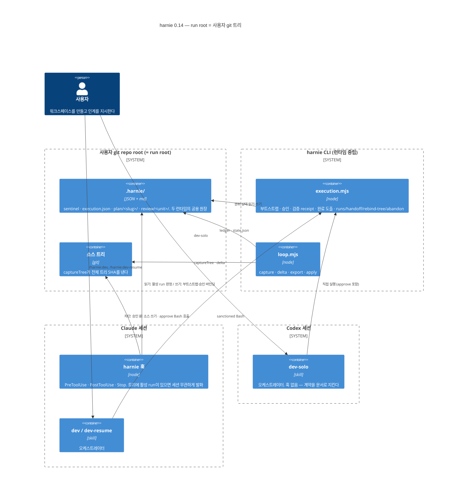
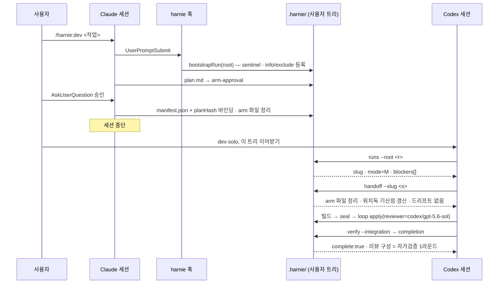
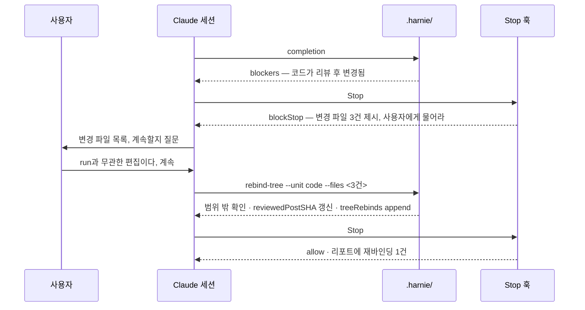
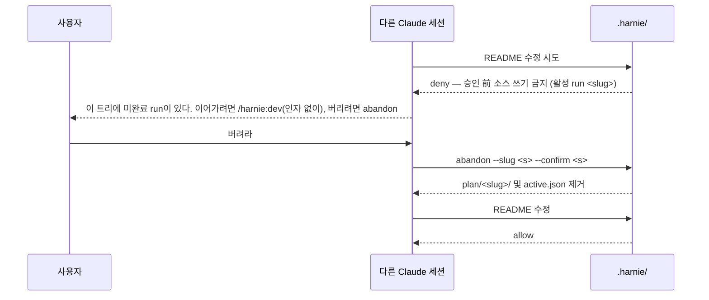
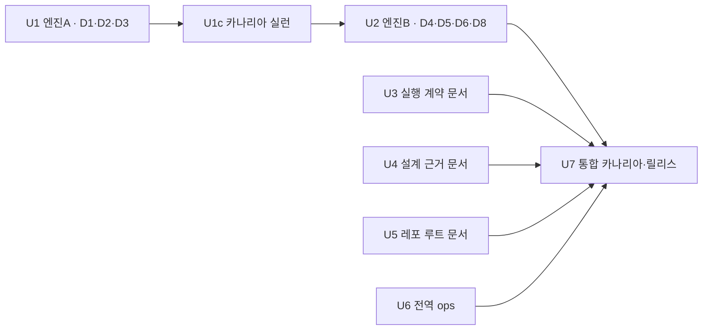

# harnie 0.14 설계 — run root = 사용자 작업 트리, 크로스 런타임 인계

상태: rev-3(팀 검토 3라운드 + 사용자 판단 6건 반영, 열린 항목 없음) · 대상 커밋 `42f7291`(0.13.1) · 아키텍처 고도(lightweight)

## 1. 요약

0.14는 harnie에서 워크트리 소유권을 걷어내고 그 자리에 인계 가능한 run 상태를 넣는다. run root는 세션 cwd의 git repo root가 되고(main 브랜치 포함), 격리는 사용자와 orca가 만든 워크스페이스가 제공한다. harnie가 잃는 것은 물리적 격리이고, 얻는 것은 하나의 run을 Claude `/harnie:dev`와 Codex `dev-solo`가 번갈아 완주할 수 있는 상태 계약이다.

고비용 결정 다섯 건:

| 번호 | 결정 | 대체되는 것 |
|---|---|---|
| DEC-1 | 훅 게이트의 조건에서 세션 소유 여부를 뺀다. 대신 그 잠금에서 나올 출구(`abandon`)를 같은 릴리스에 넣는다 | `isOwnerSession` 분기(`pretooluse.mjs:37`, `stop.mjs:19`)와 세션 바인딩 파일 |
| DEC-2 | 승인 경로는 run에 기록된 라벨이 아니라 실행 시점의 훅 유무가 정한다. 강제 범위는 오케스트레이터의 Bash 호출까지다 | sentinel의 `authority` 필드와 `approveCli`의 하드 게이트 |
| DEC-3 | 재개·인계는 새 상태 파일 없이 디스크 재도출로 하고, 진입점 CLI 넷을 신설한다(`runs`·`handoff`·`rebind-tree`·`abandon`) | 비활성 run을 활성으로 되돌릴 경로 부재 |
| DEC-4 | 완료 트리 바인딩은 전체 트리 SHA를 유지한다. 드리프트 수용은 리뷰 범위 **밖** 파일에 한정하고 이력을 남긴다 | `computeCompletion` S 분기의 재리뷰 전용 데드엔드 |
| DEC-5 | 한 릴리스로 내되 **머지 사이에 실런을 끼운다**. D1 계열이 먼저 트리에 착륙하고 관측된 뒤 D4·D5 계열이 얹힌다 | 네 성격의 변경을 한 번에 내고 첫 실패의 귀속을 포기하는 것 |

가장 큰 위험 셋:

1. ~~**훅 없는 구간에서 계약이 문서로만 남는다.** Codex에는 harnie 훅이 없다.~~ **이 전제는 틀렸다(2026-08-31 실측, 0.14.4에서 정정).** harnie 훅은 플러그인의 `hooks/hooks.json`으로 선언되고 Codex도 그것을 로드한다 — Codex 세션 화면의 `Running 3 PreToolUse hooks`가 그 증거이고, 실제로 harnie의 deny 문구가 Codex에서 발화했다. 조사 단계에서 `agent-ops`의 `codex-hooks.json`에 harnie 배선이 없다는 것만 보고 "훅 없음"으로 결론지은 것이 오류다(플러그인 훅은 그 파일과 무관하게 등록된다). 방향이 반대인 서술이라 위험했다 — Codex 구간은 강제가 **없는** 것이 아니라 오히려 **더** 걸린다.
2. **run root가 사용자 실작업 트리라 완료 판정이 무관한 편집에 노출된다.** DEC-4가 데드엔드는 없애지만 승인 축이 하나 늘어난다.
3. **0.13.1은 실런 0회이고 0.14도 0회로 출발한다.** 첫 run의 무대가 버려도 되는 워크트리에서 사용자의 실작업 트리로 바뀌므로, 완료 바인딩·`.harnie/` 잔류·세션 잠금이 첫 run에서 동시에 처음 발화한다. DEC-5와 §12 U7의 스크래치 클론 절차가 이에 대한 대응이다.

## 2. 목표·범위·비목표·제약

**목표**: 한 run을 Claude와 Codex가 양방향으로 이어받아 완주한다. 중단된 run을 다음 미완료 스테이지부터 재개한다. harnie가 git worktree를 만들지도 지우지도 않는다.

**성공 지표**

| 지표 | 측정 |
|---|---|
| 인계 왕복 | `/harnie:dev` 시작 → Codex `dev-solo` 완주, 역방향도 1회씩 |
| 재개 | 임의 스테이지 중단 run을 재개해 완주 1회 |
| 출구 | 미완료 run이 잠근 트리에서 비-owner 세션이 `abandon`으로 빠져나오는 것 1회 |
| 회귀 | 스테이지별 테스트 전건 통과(기준선 정산은 §12) |
| 잔존 워크트리 | 릴리스 후 harnie 코드에 `git worktree` 호출 0건 |

**범위**: harnie 엔진(`hooks/`·`scripts/`), harnie 문서면, 전역 지침(`~/workspace/agent-ops/claude/`).

**제약**

- D1~D8은 사용자가 확정했다. 이 문서는 그 결정을 성립시키는 경계만 설계한다.
- routine 5종은 영향 없음이 확인됐다(g3 §2: wrapper·지시서 전수 검색에서 `worktree|.harnie|harnie:dev|dev-solo|orca` 0건, 의존은 `pr-review`·`comment-resolve`·`quality-digest` 스킬 본문을 읽기 전용 기준으로 참조하는 것뿐). 유닛을 만들지 않는다.
- `~/Tradlinx/PR-ADO.md`·`DataPlatform/*.md`·`agent-ops/guidelines/GIT.md`도 dev 파이프라인 실행 방식을 전제하는 문장이 없다(g3 §3). 범위 밖.

## 3. 요구사항

**FR**

| 번호 | 내용 |
|---|---|
| FR-1 | run root는 `findRoot(cwd)`가 반환하는 git repo root다. 브랜치를 보지 않는다 |
| FR-2 | 같은 트리에 미완료 run이 있으면 새 run 시작을 거부하고 다른 워크트리 생성 또는 재개를 안내한다. dev·dev-solo를 하나로 센다 |
| FR-3 | 트리의 재개 가능한 run 목록과 각 run의 다음 블로커를 기계로 도출해 제시한다 |
| FR-4 | 비활성 run을 활성으로 전환하고 런타임 종속 상태를 정리하는 단일 진입점이 있다 |
| FR-5 | 리뷰 라운드마다 리뷰어의 런타임과 모델을 기록하고, 완료 리포트가 그 구성을 드러낸다 |
| FR-6 | 승인 경로는 실행 시점 런타임이 정한다. Claude 세션의 `approve --plan-hash` Bash 호출은 차단되고, Codex 세션에서는 정상 경로다 |
| FR-7 | 기록된 트리와 현재 트리가 다르면 변경 파일 목록을 제시하고 사람에게 계속 여부를 묻는다 |
| FR-8 | 어느 세션이든, 승인 前 국면에서도, 미완료 run을 사용자 확인 하에 폐기하고 트리를 풀 수 있다 |

**NFR**

| 번호 | 내용 | 근거 |
|---|---|---|
| NFR-1 | 새 상태 파일을 만들지 않는다. 재개에 필요한 값은 기존 산출물에서 도출하거나 기존 스키마에 필드로 얹는다 | `bootstrap-adherence.md` §3.7이 이미 채택한 원칙 |
| NFR-2 | 인계 중 어느 시점에 어느 런타임이 죽어도 남은 디스크 상태만으로 다른 런타임이 이어받는다 | D8 |
| NFR-3 | 승인 권위 우회 경로가 늘지 않는다 | |
| NFR-4 | `.harnie/`가 사용자 브랜치에 커밋되지 않는다 | |

## 4. 고비용 결정

### DEC-1. 훅 게이트의 조건과 그 출구

오늘 `pretooluse.mjs:37`과 `stop.mjs:19`는 `isOwnerSession`이 거짓이면 게이트를 통째로 연다. `sentinelSessionIds`가 비면 항상 거짓이고(`lib.mjs:149`), Codex가 만든 run은 정확히 그 상태다(`initCliAuthority`가 `sessionId: null`로 부트스트랩). 크로스 런타임 인계는 이 상태를 상시화한다.

| 대안 | 구조 | 강제력 | 적합 조건 |
|---|---|---|---|
| A. 소유권 이양 커맨드 | `handoff`가 새 세션을 owner로 등록하고 게이트는 계속 owner를 본다 | 커맨드를 부르지 않은 세션은 무방비 | 세션이 항상 규약대로 진입할 때 |
| B. 조건 삭제 | 게이트는 `ctx.active`만 본다 | 그 트리의 모든 Claude 세션 | run root가 사용자 트리이고 세션이 여럿 붙을 때 |

**B를 택한다(D4).** 워크트리가 있던 동안 owner 검사는 "이 세션의 worktree를 찾아 주는" 해석 장치와 한 몸이었다(`resolveRoot` ①). 해석이 `findRoot` 하나로 끝나면 owner 검사에 남는 기능은 게이트를 여는 것뿐이다.

**B는 코드가 "실측 사고"라고 기록한 동작을 되살린다.** `lib.mjs:141-145`의 주석: 과거 "빈 owner 목록 = 전원 owner" 폴백이 harnie를 실행한 적 없는 세션의 소스 쓰기까지 워크스페이스 단위로 잠갔다. 사고의 실체는 잠금 자체가 아니라 **출구가 없었다는 것**이다. 오늘 그 트리에서 빠져나올 방법은 없다. 새 run은 D2가 거부하고, `.harnie/active.json` 삭제는 Write를 `isControlPath`(`guards.mjs:9`)가, Bash를 `referencesHarnie`(`:98-101`)가 막는다.

그래서 B는 출구와 한 몸으로만 성립한다.

```
node <plugin>/scripts/execution.mjs abandon --root <repo> --slug <slug> --confirm <slug>
```

`guardActive`를 부르지 않고 owner도 보지 않는다. `.harnie/plan/<slug>/`를 `.harnie/abandoned/<slug>-<시각>/`으로 **옮기고**, 그 slug가 활성이면 `active.json`을 지운다. `--confirm`에 slug를 다시 적게 하는 것이 유일한 방어이고, 그것이 막는 것은 오타이지 의도가 아니다.

**방어를 올리는 대신 결과를 되돌릴 수 있게 한다**(사용자 확정 2026-08-28). 이 출구를 당기는 주체는 대개 사람이 아니라 진행이 막힌 오케스트레이터이고, 잘못 당기면 리뷰 원장과 승인 기록이 사라진다. 그렇다고 확인 절차를 세게 하면 잠긴 트리에서 나오는 유일한 길이 좁아져 DEC-1이 무너진다. 그래서 방어는 그대로 두고 삭제를 이동으로 바꾼다 — 옮겨진 디렉터리는 `runs` 스캔에서 제외되고, 소스 코드는 어느 경로로도 건드리지 않는다. `isSanctionedCli`가 이 커맨드를 신뢰 경로로 통과시켜야 하고(그렇지 않으면 출구가 다시 막힌다), 이동뿐이므로 권위 상태를 새로 만들지도 않는다.

D4가 함께 요구한 "접촉한 세션 자동 등록"은 **기록으로도 남기지 않는다**(사용자 확정 2026-08-28). 게이트가 세션을 보지 않으므로 등록이 강제에 기여하지 않고, D6가 요구하는 "누가 이 run을 거쳤는가"는 라운드별 `reviewer` 필드가 이미 답한다. 남겨 두면 소비자 없는 필드가 세션마다 자라고, 무엇보다 그 필드가 살아 있는 한 owner 검사를 되살릴 통로가 남는다. `sentinel.sessionIds`는 삭제한다.

### DEC-2. 승인 권위와 그 강제 범위

오늘 `authority`는 `createRun`에서 쓰이고 `approveCli`에서만 읽힌다(`:619`, `:1089`). 방향이 비대칭이다. hook run을 Codex가 이어받으면 승인이 원천 불가능하고, cli run을 Claude가 이어받으면 `approve --plan-hash`가 sanctioned Bash로 통과해 AskUserQuestion 원샷 바인딩이 우회된다.

| 대안 | 구조 | 인계 | 우회 표면 |
|---|---|---|---|
| A. `adopt --authority` 전환 커맨드 | 라벨을 뒤집는다 | 성립 | 뒤집을 수 있으면 Claude도 뒤집어 자가승인한다. 오늘의 구멍이 명시적 커맨드가 될 뿐 |
| B. 라벨 폐기, 훅 유무가 결정 | `authority` 삭제. Claude 세션에서는 훅이 `approve` Bash 호출을 deny하고 arm-approval + AskUserQuestion만 남는다 | 성립 | 훅이 발화하지 않는 호출 경로 |

**B를 택한다(D5).** 기제가 CLI 안에 있지 않다는 점이 이 결정의 핵심이다. `execution.mjs`는 호출 세션에 훅이 설치됐는지 알 수 없고, 알아낼 방법을 만들면 그것은 제약 대상이 스스로 신고하는 구조가 된다. 그래서 판정은 CLI 밖 `guards.mjs`에 둔다. `approveCli`에서는 `authority` 검사를 삭제한다.

**deny를 놓을 자리는 `decideBash` 본문이고 `isSanctionedCli`가 아니다.** `isSanctionedCli`는 false를 내면 deny가 아니라 다음 검사로 흘려보낸다(`guards.mjs:207-217`). 그 다음은 `referencesHarnie`인데 문제의 명령에는 `.harnie` 문자열이 없다 — 스크립트 경로는 `…/harnie/scripts/execution.mjs`이고 `--root`는 repo root다. 정규식이 불일치하면 마지막 `return { deny: false }`로 떨어져 **허용된다**. 거기에 판정을 두면 오늘 엔진이 막던 것(`approveCli`의 throw)을 지우고 아무도 막지 않는 상태가 되어 NFR-3이 깨진다.

```js
// decideBash 본문 맨 앞, isSanctionedCli 호출보다 먼저
if (isExecutionSubcommand(cmd, "approve"))
  return { deny: true, reason: "…arm-approval + AskUserQuestion 경로…" }
```

신뢰 CLI 형태 여부와 무관하게 먼저 걸린다. 테스트도 `isSanctionedCli`가 아니라 `decideBash`가 `{deny:true}`를 내는 것으로 못박는다 — `isSanctionedCli`만 보는 테스트는 이 회귀를 통과시킨다.

**강제 범위를 정확히 적는다.** 이 deny는 오케스트레이터가 Bash로 `approve`를 부를 때만 발화한다. 다음 셋은 덮지 못한다.

- 훅이 미설치·비활성인 Claude 세션. 훅이 없으면 훅이 막을 수 없다.
- Claude 세션이 spawn한 codex 서브프로세스. `decideCodex`는 `cwd`와 sandbox를 검사하지만(`guards.mjs:253`) 그 안에서 실행되는 셸까지 보지 않는다. workspace-write 빌더가 `node …/execution.mjs approve`를 실행하면 통과한다.
- **Codex 세션 자체.** Claude가 승인 없이 M을 넘기고 Codex가 `approve`를 부르면, 사람 확인을 거치지 않은 M run이 성립한다. Codex에는 AskUserQuestion 바인딩이 없어 `approve` 호출 자체가 유일한 감사 기록이고, dev-solo 계약의 "plan을 제시하고 명시적 승인을 받은 뒤 부른다"가 그 자리를 규율로 메운다. 0.13과 같은 상태이며 이 릴리스가 좁히지 않는다.
  - **0.14.0~0.14.3은 이 항목을 반대로 구현했다(0.14.4에서 수정).** 훅이 Claude에서만 돈다는 위 §1의 틀린 전제 위에서 `decideBash`의 deny를 런타임 구분 없이 걸었고, 훅이 Codex에서도 도는 탓에 **dev-solo가 M run을 승인하는 경로가 통째로 막혔다** — 0.13에서는 되던 것이다. 안내 문구가 가리키는 대체 경로(arm-approval + AskUserQuestion)는 Codex에 그 도구가 없어 따를 수도 없었다. 0.14.4는 사람 확인 바인딩이 있는 런타임에서만 deny하고, 판별은 공식 훅 계약이 Codex 전용 확장으로 명시한 페이로드 `turn_id`와 환경변수 `PLUGIN_ROOT`로 한다(`CLAUDE_PLUGIN_ROOT`는 Codex도 호환용으로 설정하므로 판별자가 아니다). 모르면 deny 쪽으로 떨어뜨린다 — 오분류의 두 방향 중 자가승인이 열리는 쪽이 더 나쁘다.
  - **왜 U7 카나리아가 못 잡았나**: 정방향은 Claude가 이미 승인한 run을 Codex가 이어받았고, 역방향은 Codex에게 `approve`를 부르지 말라고 명시했다. Codex가 승인하는 경로를 한 번도 밟지 않은 것이 카나리아 설계의 구멍이다. U2의 회귀 테스트도 deny가 나는 것만 단정해 런타임 차이를 볼 수 없었다.

따라서 `docs/enforcement-map.md`에서 이 항목은 "강제"가 아니라 **"강제 — 오케스트레이터 Bash 한정"**으로 적는다. 그럼에도 B는 오늘보다 표면이 좁다. 오늘은 cli run을 이어받은 Claude 오케스트레이터가 직접 Bash로 승인할 수 있고, B는 그 경로를 닫는다(NFR-3 충족).

부수로 `approve` 성공 시 `ONE_SHOT_ARM_FILES`를 정리한다. 이것이 §7.4의 데드엔드를 닫는다.

### DEC-3. 재개·인계의 진입점

g1 Q3-1이 확인한 대로 M run의 진행 위치는 대체로 도출된다(`mode` → `manifest.json` 유무 → `review/<unit>/state.json.machineState` → `receipt.json` → 통합 receipt). 문제는 그 값을 쓸 진입점이 없다는 것이다.

**"재개할 run은 항상 0개나 1개다"는 참이 아니다.** D2가 보장하는 것은 *활성* 미완료 run이 최대 1개라는 것뿐이다(`bootstrapRun:646-653`). 완료된 run은 새 run에 자리를 내주고 plan 디렉터리로 남는데, 그 완료 판정은 얼어붙지 않는다. `genuinelyComplete` → `computeCompletion`의 S 분기는 호출 시점의 `captureTree(root)`와 비교하므로(`:530-533`), 사용자가 트리를 한 줄 고치는 순간 **과거에 닫힌 run들이 전부 소급으로 미완료가 된다.** D1이 run root를 사용자 트리로 옮기면 이것은 예외가 아니라 기본값이다.

그래서 닫힘을 디스크에 못박는다. `bootstrapRun`이 완료된 run을 교체할 때, 이미 완료를 판정한 그 자리에서 그 run의 `execution.json`에 `closedAt`을 쓴다. `runs`는 `closedAt`이 없는 run만 낸다. 필드 하나, 쓰기 한 번, 이미 아는 사실의 기록이다.

신설 진입점 넷:

| 커맨드 | `guardActive` | 하는 일 |
|---|---|---|
| `runs --root <r>` | 안 부름 | `.harnie/plan/*` 스캔 → `closedAt` 없는 run의 `{slug, mode, active, blockers[]}` |
| `handoff --root <r> --slug <s>` | 안 부름 | 활성 전환 · 런타임 종속 상태 정리 · 드리프트 보고(§6) |
| `rebind-tree` | 부름 | DEC-4 |
| `abandon` | 안 부름 | DEC-1의 출구 |

**흔한 재개는 이 넷을 쓰지 않는다.** 오늘 재개가 불편한 진짜 이유는 `resumeRun`이 `(s.base || s.slug) === base` 정확 일치를 요구해(`:651`) 원 프롬프트를 글자 그대로 재현해야 한다는 것이다. sentinel에 `base`가 이미 있으므로(`:618`), **인자 없는 `/harnie:dev`가 `active.json.base`를 읽어 그대로 `bootstrapRun`에 넘긴다.** 스킬 문서 몇 줄, 엔진 0줄. `/harnie:dev-resume`은 그 위의 얇은 층이고, 활성 run이 하나뿐인 흔한 경우에는 원소 1개짜리 목록을 보여준 뒤 같은 경로로 들어간다. 넷이 실제로 필요해지는 것은 소급 미완료된 과거 run을 되살릴 때, 런타임을 바꿀 때, 드리프트를 만났을 때, 그리고 빠져나올 때다.

동시에 두 스키마 결함을 고친다. 둘 다 오늘 잘못된 값을 내고 있고 완료 판정에 걸린다.

| 결함 | 원인 | 처리 |
|---|---|---|
| 설계 리뷰 유닛이 완료 판정에 안 보인다 | `design`이 manifest의 `reviewUnit` 어디에도 등재되지 않아 `unitNames`(`:398`)에 안 들어간다. 설계 리뷰를 한 번도 안 돌린 M이 `complete:true`가 된다 | `buildSnapshot`이 M에서 `design`을 예약 유닛으로 항상 포함. manifest 스키마·`validateManifest` 무변경 |
| 비-owner 안내 문구가 거짓이 된다 | `sanctionFailureWhy`(`guards.mjs:203`)가 deny 원인으로 "비-owner 세션 등"을 안내하는데 DEC-1이 그 개념을 없앤다 | 문구 교체 |

### DEC-4. 완료 트리 바인딩의 드리프트

D3이 전체 트리 SHA 유지를 확정했다. 남은 설계 문제는 불일치의 처리다.

**"보고"의 실제 코드 경로를 먼저 적는다.** 오늘 S run이 드리프트를 만나면 `computeCompletion`이 blocker를 내고 `stop.mjs:23-29`가 `blockStop`한다. 사람에게 보고하고 기다리는 것이 아니라 턴 종료를 막고 모델을 재시도시킨다. 0.14도 이 경로를 유지한다 — 차단이 없으면 오케스트레이터가 조용히 끝낼 수 있고, 그것이 이 게이트의 존재 이유다. 바뀌는 것은 두 가지다. `blockStop`의 메시지가 변경 파일 목록과 "사용자에게 물어라"를 담고, 사용자가 답한 뒤 진행할 경로가 생긴다.

```
node <plugin>/scripts/execution.mjs rebind-tree --root <r> --slug <s> --unit <u> --files <경로 목록>
```

1. 기록된 SHA와 현재 트리의 delta를 계산한다.
2. `--files`가 그 delta와 정확히 일치하지 않으면 실패한다.
3. **변경 파일이 그 리뷰 유닛의 범위와 하나라도 겹치면 실패한다.** M은 manifest task의 scope(`computeScopeHash`가 이미 쓰는 값), S는 리뷰가 승인한 delta의 파일 집합이 범위다.
4. 통과하면 `state.json.reviewedPostSHA`를 갱신하고 `treeRebinds[]`에 `{unit, from, to, files, at}`를 append한다.

3번이 이 장치를 `--accept-drift` 류의 권위 구멍과 가르는 지점이다. 리뷰된 코드를 고친 뒤 재바인딩하는 것은 불가능하고, 수용되는 것은 리뷰 범위 밖의 편집뿐이다. 이력은 완료 리포트에 드러나므로 은폐되지 않는다.

`--files`가 막는 것은 하나뿐이다: **사람이 판단한 시점과 재바인딩 시점 사이에 트리가 또 바뀌는 것.** 사용자가 3건을 보고 "무관하다"고 답한 뒤 빌드가 네 번째 파일을 건드리면 `--files` 불일치로 실패한다. 이것을 "호출자가 변경을 읽었다는 증명"으로 읽어서는 안 된다 — 호출자는 `handoff`가 방금 출력한 목록을 그대로 되붙일 수 있고, 그건 왕복일 뿐이다.

**대안으로 검토하고 기각한 것**: 리뷰 시점의 `changedPaths`를 `state.json`에 적고 `computeScopeHash`로만 비교하는 방식(새 CLI 0개, 필드 1개). 더 싸지만 완료 바인딩을 전체 트리에서 scope 한정으로 바꾸는 것이라 D3과 정면으로 어긋난다. 위 3번이 그 아이디어의 유용한 절반을 가져오되 완료 판정은 전체 트리에 남긴다.

Claude 세션에서 AskUserQuestion을 훅으로 강제하지는 않는다. 승인 게이트와 같은 무게를 주면 arm 파일 계열이 하나 더 늘고, 그 복잡도가 막는 실패를 지목할 수 없다.

### DEC-5. 출하 순서

0.14는 성격이 다른 네 묶음이다. 한 번에 내면 첫 실패의 귀속이 불가능하다 — `.harnie/`에 남는 증거는 root 해석 오류와 트리 SHA 불일치와 세션 잠금을 구분하지 못한다.

| 묶음 | 성격 | 되돌리기 |
|---|---|---|
| D1·D2·D3·D7 | 삭제 + 판정 로직. 사용자 트리에서 처음 발화 | 쉬움~중간 |
| D4·D5·D6·D8 | 가드 완화 2건. 잠금(D4)과 해제(D5)가 반대 방향으로 동시에 움직인다 | 어려움. 디스크에 남은 run 상태가 새 규칙을 전제한다 |

**한 릴리스로 내되 머지 사이에 실런을 끼운다.** §12의 U1 → U2 순차는 그대로이고, 그 사이에 스크래치 클론 실런 1회를 삽입한다(U1c). D4와 D5는 서로를 필요로 하지 않지만(각각 `isOwnerSession`과 `approveCli`의 `if`, 다른 파일), D8이 둘 다를 필요로 하므로 2단계 안에서는 함께 간다. 1단계에 `abandon`이 반드시 들어간다 — D2의 거부와 D3의 전체 트리 바인딩만으로도 잠금은 이미 성립한다.

**한 버전으로 낸다**(사용자 확정 2026-08-28). D8이 이번 릴리스의 핵심 요구이므로 D4·D5 계열을 다음 버전으로 미루지 않는다. 단계 분리는 버전이 아니라 U1c 실런이 맡는다.

## 5. 권장 구조

### 5.1 삭제

| 대상 | 위치 | 이유 |
|---|---|---|
| `scripts/worktree.mjs`와 그 테스트 | 파일 삭제 | 프로그램 호출자 0건. `--abandon`이 열던 데드엔드는 생성이 사라지면 존재하지 않는다. 단 `ensureExcludeEntries`(`:34-46`)는 §8이 재사용하므로 함께 지우지 않는다 |
| 세션 바인딩 4함수·`SESSION_NAME_RE`·`listActiveRunWorktrees`·`resolveRoot`·`isOwnerSession`·`sessionIds` | `hooks/lib.mjs:57-85`, `:99-151`; `execution.mjs:607-612`, `:618` | `resolveRoot`의 ①은 바인딩 파일에, ③은 `.harnie-wt` 컨테이너에 의존한다. 둘 다 생기지 않는다. 호출부를 `findRoot`로 교체 |
| `referencesWorktreeContainer`·`decideActiveRunDeletion` 계열·`isActiveTaskWorktree` 계열·`isControlPath`의 `.harnie/sessions/` 분기 | `scripts/guards.mjs:12`, `:86-159` | 보호·판정 대상이 사라진다. §8이 대체 여부를 판정한다 |
| `authority` 필드와 그 게이트 | `execution.mjs:619`, `:1089-1090` | DEC-2 |
| bootstrap의 워크트리 경로 전부 | `hooks/bootstrap.mjs:38-43`, `:81-92`, `:96` | `isGitRoot` 검사 + `bootstrapRun` 두 줄로 축소 |
| `pretooluse.mjs`의 `mainRoot`·`activeRuns`·`outside` 보정 | `:20`, `:24`, `:60-61` | `root !== mainRoot`가 항상 거짓이 되어 죽은 분기다 |

### 5.2 신설 — 없으면 무엇이 깨지는가

`instructions/builder-contract.md` §Simplicity에 따라, 아래 표를 통과하지 못한 항목은 넣지 않는다. 초안에서 세 개가 이 표에 걸려 빠졌다(§9).

| 항목 | 종류 | 없으면 깨지는 것 |
|---|---|---|
| `execution.mjs abandon` | 서브커맨드 | DEC-1의 잠금에서 나올 방법이 없다. 오늘 그 상태는 Write·Bash 양쪽이 막혀 harnie 밖 터미널 외에 출구가 없다 |
| `execution.mjs runs` | 서브커맨드 | 소급 미완료된 과거 run을 열거할 방법이 없다(DEC-3) |
| `execution.mjs handoff` | 서브커맨드 | 비활성 run을 활성으로 되돌릴 수 없고, 남은 arm 파일과 워치독 기산점이 §7.4의 데드엔드를 만든다 |
| `execution.mjs rebind-tree` | 서브커맨드 | 리뷰 범위 밖 편집 한 건으로 run이 재리뷰 외에 닫히지 않는다 |
| `execution.json.closedAt` | 필드 | 사용자가 트리를 고치는 순간 닫힌 run이 전부 재개 목록에 되살아난다 |
| `state.json`의 라운드별 `reviewer: {runtime, model}` | 필드 | D6의 리뷰 구성 리포트를 만들 입력이 없다 |
| `treeRebinds[]` | 필드 | 드리프트 수용이 리포트에 안 남아, 새로 만든 권위 표면이 관측되지 않는다 |
| `decideBash`의 `approve` deny(`isSanctionedCli`보다 앞) | 훅 분기 | DEC-2의 자가승인 차단이 성립하지 않는다. 위치를 `isSanctionedCli`로 잘못 잡으면 fail-open이라 오늘보다 나빠진다 |
| `buildSnapshot`의 `design` 예약 | 도출 규칙 | 설계 리뷰를 한 번도 안 돌린 M run이 `complete:true`가 된다 |
| `.git/info/exclude`에 `.harnie/` | 부트스트랩 1회 | `git add -A`가 run 제어 상태를 사용자 브랜치에 커밋한다. 가드는 문자열 매칭이라 원리적으로 못 잡는다 |
| 기본 브랜치 경고 | 부트스트랩 1회 | 워크스페이스 없이 main에서 시작한 것을 사용자가 모른다 |
| `commands/dev-resume.md` | 커맨드 1개 | D7. 신규 스킬은 만들지 않는다 |

### 5.3 불변

`loop.mjs`가 **sentinel·authority·session을 검사하지 않는다**는 성질을 유지한다. 그 파일이 안 바뀐다는 뜻은 아니다 — `apply`는 `--reviewer-runtime`·`--reviewer-model`을 받게 되고, 그 값은 기록될 뿐 어떤 판정에도 들어가지 않으므로 포터블 코어라는 성질은 그대로다.

ledger 스키마, `planHash` 도출, manifest 검증, `seal`/`seal-verify`, `captureTree`의 전체 트리 SHA는 그대로 둔다. 워치독의 판정 로직도 그대로이고, 인계로 왜곡되는 기산점만 `handoff`가 손댄다.

### 5.4 컨테이너



두 런타임은 서로를 모른다. 공유하는 것은 `.harnie/` 하나이고 그것이 인계의 전부다.

## 6. 인계 지점의 상태 계약

**런타임 중립 — 양쪽이 그대로 읽고 쓴다**

`sentinel.{track, slug, base, planHash, mode}` · `execution.json.{mode, phase, difficulty, closedAt}` · `plan.md` · `manifest.json` · `review/<unit>/{ledger.json, state.json, round-N.txt, receipt.json}` · `review/integration/receipt.json` · `baseline-<n>.json` · `.seal.json`.

이들은 오늘 이미 중립이다. `deriveCompletion`은 authority·session·provider를 읽지 않고, `loop.mjs`에는 그 검사가 아예 없다.

**세션 종속 — 인계 시 `handoff`가 정리한다**

| 필드 | 왜 종속인가 | 처리 |
|---|---|---|
| `.arm-approval.json` · `.pending-approval.json` | Claude AskUserQuestion의 `tool_use_id`에 바인딩된다. Codex에는 소비할 훅이 없다 | 삭제 |
| `.arm-rebind.json` · `.pending-rebind.json` | 동일 | 삭제 |
| `readOnlyThreads` · `tasks[].builderThreadId` | Codex MCP thread id는 그 세션 안에서만 유효하다. Claude ↔ Claude 사이에서도 종속이다 | 비운다 |
| `tasks[].builderBoundAt` · `startedAt` | 벽시계 예산의 기산점(`guards.mjs:54`). 세션이 죽어도 계속 흐르므로 복귀 직후 첫 빌더 호출이 deny된다 | 현재 시각으로 재기산 |

**중단 시간은 벽시계 예산에서 뺀다. 호출 횟수는 빼지 않는다.** `tasks[].codexCalls`와 `watchdogExtensions`는 누적이고, 인계로 리셋되면 상한 우회 경로가 된다(`execution.mjs:965` 주석이 기록한 DR-107과 같은 계보).

**기록 전용 — 판정에 쓰지 않는다**

라운드별 `reviewer`와 `treeRebinds[]`. `reviewer`는 호출자가 정직하게 넘겨야 성립하는 advisory다. `loop.mjs apply`가 리뷰어를 스폰하지 않으므로 기계로 확인할 수 없고, 리포트 문구는 이것이 오케스트레이터의 신고이지 관측이 아님을 담는다.

**`guardActive`의 비대칭**: `handoff`·`runs`·`abandon`은 부르지 않는다(비활성 run이 대상이므로). `rebind-tree`는 부른다. `seal-verify`가 오늘 안 부르는 비대칭은 이번 범위에서 손대지 않는다 — 인계에 유리하게 작동하고, 고치면 인계 경로가 좁아진다.

## 7. 핵심 시나리오

### 7.1 Claude → Codex 인계 (승인 후)



승인이 Claude에서 이뤄졌는데 Codex가 그대로 이어받는 것이 DEC-2의 핵심이다. `manifest.json`과 `planHash`는 런타임 중립이므로 Codex는 승인을 다시 하지 않는다.

### 7.2 트리 드리프트



변경이 리뷰 범위와 겹치면 `rebind-tree`가 실패하고 출구는 재리뷰뿐이다. 사용자가 "무관하지 않다"고 답해도 같다. 기계는 두 답 중 어느 쪽이 옳은지 모르지만, 범위 겹침은 안다.

### 7.3 활성 run 충돌과 출구



거부 자체는 오늘도 있다(`execution.mjs:652`). 바뀌는 것은 문구와, 그 문구가 가리키는 출구가 실재한다는 것이다.

### 7.4 승인 대기 중 중단

가장 흔한 중단 시점이다. 사람이 승인 질문 앞에서 자리를 뜨고 세션이 죽는다. `.arm-approval.json`이 디스크에 남고, 오늘은 여기서 나갈 길이 없다 — Codex에는 그것을 소비할 훅이 없고, `approve`는 `authority`로 막히고, 재-arm은 `otherArmPending`(`:743`)이 거부하고, 파일 삭제는 Write와 Bash 양쪽이 막는다.

0.14에서는 세 경로가 열린다. `handoff`가 arm 파일을 선제 정리하고, `approve`가 성공 시 정리하며, `abandon`이 최후 출구다. 이 데드엔드를 닫는 것이 D8이 실사용에서 사는지를 가른다.

## 8. 위협모델 재평가

`bootstrap-adherence.md` §3.7의 전제 "지워진 것은 harnie가 만든 워크트리"가 깨진다. §3.7이 보호하던 대상은 존재하지 않고, 훨씬 값비싼 것이 같은 자리에 있다.

**다시 걸 것**

| 조치 | 막는 것 | 강제 수준 |
|---|---|---|
| `.git/info/exclude`에 `.harnie/` 등록 | `git add -A`·`git commit -am`이 run 제어 상태를 사용자 브랜치에 커밋하는 것 | 기계. 기존 `ensureExcludeEntries`의 인자를 `.harnie-wt/`에서 `.harnie/`로 바꾸고 `hooks/lib.mjs`로 옮겨 부트스트랩이 부른다. 그 함수가 `.harnie/`를 일부러 뺐던 근거는 "어차피 버려지는 worktree"였고, D1이 그 전제를 무효화한다 |
| 기본 브랜치 경고(차단 아님) | 워크스페이스 없이 main에서 시작하는 것 | 통지. D1이 차단을 배제했다 |
| `approve` Bash 호출 deny | Claude 오케스트레이터의 자가승인 | 기계, 단 오케스트레이터 Bash 한정(DEC-2) |
| `rebind-tree`의 범위 겹침 거부 | 리뷰된 코드를 고친 뒤 재바인딩 | 기계 |

**대체하지 않는 것**

§3.7의 `decideActiveRunDeletion`을 사용자 트리 보호로 확장하지 않는다. 근거 셋. 그 트리는 orca와 사용자 소유이고 harnie가 지키겠다고 나서면 `orca-dispatch.md:3`이 선언한 경계가 다시 무너진다. §3.7이 스스로 기록한 잔여 한계(문자열 리터럴 부분일치, 다른 root에서의 절대경로 지목, 셸 변수·글롭 우회)는 사용자 트리에서 더 크게 벌어진다 — `rm -rf`의 대상 표현이 훨씬 다양하다. 그리고 그 자리의 저비용 대응은 엔진이 아니라 운영 규칙이라고 §3.7이 이미 판정했다(정리 지시는 대상을 명시 열거).

**규율에 맡기는 것 — 기계가 못 한다**

- **M 승인 게이트.** 목록에서 가장 비싼 항목이다. `dev-solo`가 plan을 사용자에게 제시하고 확인받는 것은 문서 계약이고 기계가 확인하지 않는다. Claude가 승인 없이 넘긴 run을 Codex가 `approve`로 닫아도 탐지되지 않는다.
- **Codex 구간의 나머지.** 승인 前 소스 쓰기 금지, control 파일 직접 쓰기 금지, Stop 완료 강제가 발화하지 않는다. 유일한 탐지 채널은 `seal`/`seal-verify`이고 그것도 producer 창만 덮는다.
- **`.harnie-wt` 잔재의 정리.** U1이 `listActiveRunWorktrees`와 `worktree.mjs remove`를 지우므로, 0.13이 돌았던 레포에 남은 워크트리와 `harnie/<slug>` 브랜치를 열거·정리할 harnie 도구가 없어진다. 평범한 `git worktree list`로 사람이 1회 치운다(§12 U7 0단계).
- **훅이 없는 Claude 세션, 그리고 Claude가 spawn한 codex 서브프로세스**(DEC-2의 두 잔여).
- **main에서 실행하는 것.** 경고만 한다.
- **사람과 다른 도구의 손 편집.** DEC-4가 데드엔드를 없앨 뿐 편집을 막지 않는다.
- **`.harnie` Bash blanket deny의 마찰.** `referencesHarnie`는 명령 문자열에 `.harnie`가 있으면 읽기까지 막는다. 그 디렉터리가 사용자 트리 루트에 있으므로 `cat .harnie/active.json` 같은 조회가 상시로 막힌다. 완화하지 않는다(사용자 확정 2026-08-28) — 읽기와 쓰기를 명령 문자열로 구분하는 판정은 파이프·리다이렉트에 뚫리고, 공인 조회 경로(`loop.mjs export`)와 Read 도구가 있다. 마찰은 인정하고 감내한다. U7 실런에서 견디기 어렵다고 판명되면 그때 별건으로 다룬다.

## 9. 만들지 않는 것

- **워크트리를 다른 이름으로 재도입하지 않는다.** 임시 트리, 섀도 체크아웃, 스테이징 디렉터리 전부.
- **Codex용 훅을 이식하지 않는다.** 별개 결정이고 이번 릴리스의 성공 조건이 아니다.
- **완료 바인딩을 scope 한정 해시로 바꾸지 않는다.** D3이 전체 트리를 확정했다.
- **run 두 개 동시 실행을 지원하지 않는다.** 병렬이 필요하면 워크트리가 답이고 그것은 orca 소유다.
- **`authority` 전환 커맨드를 만들지 않는다.** DEC-2 대안 A 기각.
- **신규 스킬을 만들지 않는다.** `/harnie:dev-resume`은 커맨드 하나이고 본문은 `skills/dev/SKILL.md`의 재개 절을 참조한다.
- **routine 계열에 유닛을 만들지 않는다.** g3 §2가 비의존을 확인했다.

초안에서 §5.2의 표를 통과하지 못해 뺀 것 셋:

| 뺀 것 | 왜 |
|---|---|
| `execution.json.title` | slug가 `slugify(원문)`이라 단어를 이미 담는다. 해시 접미가 붙을 뿐 사람이 읽을 수 있다 |
| `sentinel.participants[]` | 게이트가 세션을 안 보므로 강제에 기여하지 않고, "누가 거쳤는가"는 라운드별 `reviewer`가 답한다 |
| `setMode`의 S phase 기록 | 디스크의 `phase`가 S에서 영구히 `planning`인 것은 사실이지만, `runs`가 `mode`와 blockers를 내므로 그 값을 읽는 소비자가 없다. 잘못된 값으로 남겨 두고 `docs/execution-state.md`에 그렇게 적는다 |

범위 밖으로 명시하고 이름만 남기는 죽은 코드(전역 §Coding Guidelines의 "관련 없는 죽은 코드는 언급만"): `loadContext`의 `taskRepoWorkroots`(`execution.mjs:505-509`, 값이 전부 `root`인 상수 맵이라 `guards.mjs:257`·`:262`의 비교가 항상 거짓), `decideCodex`의 `hasBuildingUnbound` 파라미터(`guards.mjs:234`). 0.14가 이 두 함수의 시그니처를 바꾸지 않으므로 건드리지 않는다. 반면 `sanctionFailureWhy`의 "비-owner 세션" 문구(`:203`)는 DEC-1이 거짓으로 만들므로 범위 안이다.

## 10. 문서 개정 계획

**이 문서로 대체되는 것**: `docs/design-0.13-L-dismantle.md`의 워크트리 존치 disposition(F5·X1 등, `:70`·`:142`). 문서 전체를 지우지는 않는다 — L 삭제 근거는 여전히 현행 계약의 근거다. 해당 행만 정리하고 이 문서를 가리키는 한 줄을 남긴다. `:47`의 "sentinel.sessionIds는 growable owner set"은 DEC-1이 그 필드를 지우므로 함께 정리한다.

| 묶음 | 파일 | 내용 |
|---|---|---|
| 실행 계약 | `commands/dev.md`, `commands/dev-resume.md`(신설), `skills/dev/SKILL.md`, `skills/dev-solo/SKILL.md`, `skills/cross-review/SKILL.md`, `instructions/loop.md`, `instructions/review-loop-driver.md`, `.claude-plugin/plugin.json` | workroot 정의 교체, `init --authority cli`의 워크트리 생성 서술 삭제, `approve`의 cli 전용 제약 삭제, sanctioned CLI 목록에서 `worktree.mjs` 제거·`abandon` 추가, `never self-init`의 적용 범위 명시, 인자 없는 `/harnie:dev` 재개와 신설 CLI 넷 |
| 설계 근거 | `docs/bootstrap-adherence.md`, `docs/execution-state.md`, `docs/architecture.md`, `docs/enforcement-map.md`, `docs/permission-prompt-reduction.md`, `docs/design-0.13-L-dismantle.md`, `docs/m-pipeline-kill-criteria.md` | §3.7 재작성(§8의 판정), 킬 기준의 비교축을 디스패치 유닛 기준으로 재정의, DR-013을 영구 미채택으로 확정, §5.1의 죽은 태스크 워크트리 조항 정리, §7 Resume을 실제 CLI에 연결, sentinel 스키마 서술 정정, `architecture.md:73`을 다세션으로, enforcement-map의 approve 항목을 "오케스트레이터 Bash 한정"으로 |
| 레포 루트 | `README.md`, `CLAUDE.md`, `AGENTS.md` | 진입 단계 표, 구성 트리 주석, orca 소유 범위 한정어("M보다 큰 작업" → 모든 run), 열린 판정 절 |
| 전역 ops | `agent-ops/claude/CLAUDE.md`, `orca-dispatch.md`, `agent-teams.md` | `:63`의 적용 범위 명시, 큰 개발 작업 라우팅 행 신설, Codex 디스패치 레시피, 같은 워크트리 재진입 절차, 워크스페이스 선행 생성 규칙 |

`CLAUDE.md`의 "열린 판정" 절은 삭제가 아니라 교체다. 항목 ①은 "0.13.1의 `resolveRoot` ③ 폴백과 `remove --abandon`을 카나리아하라"인데 0.14가 그 둘을 정확히 삭제한다. 검증한 적 없는 코드를 검증 없이 지우는 것은 위험 제거이므로 그 자체는 옳지만, 문구를 그대로 두면 존재하지 않는 코드를 가리키는 유령 지시가 된다. 0.14의 카나리아 문구로 바꾼다.

`*-ko.md` 미러는 갱신하지 않는다(harnie 언어 정책). 영문 정본 삭제가 없으므로 예외도 없다.

## 11. 리스크와 미결

| 번호 | 리스크 | 가능성 | 영향 | 완화 | 판정 시점 |
|---|---|---|---|---|---|
| R1 | 0.13.1 실런 0회 위에 0.14를 얹어 회귀 원인이 분리되지 않는다 | 높음 | 중 | DEC-5의 단계 사이 실런 + U1c 스크래치 클론 카나리아 | U1c |
| R2 | 세션 무관 게이트가 harnie와 무관한 세션을 잠근다 | 중 | 중 | `abandon`이 출구이고, `decideWriteEdit`의 deny 문구가 slug와 두 출구를 담는다(U1 카드 9). harnie를 부르지 않는 세션에는 그 문구가 유일한 접점이다 | U1c |
| R3 | `reviewer` 기록이 advisory라 리뷰 구성 리포트가 사실과 다를 수 있다 | 중 | 낮음 | 리포트에 "오케스트레이터 신고"임을 명시 | 설계 확정 |
| R4 | `handoff`가 워치독 기산점을 갱신하므로 인계를 반복하면 벽시계 상한이 무한해진다 | 중 | 중 | `codexCalls` 상한은 누적이라 그대로 걸린다 | 설계 확정 |
| R5 | `design` 예약이 진행 중이던 M run의 완료 판정을 소급으로 깨뜨린다 | 낮음 | 중 | 0.14 이전 run은 재개하지 않고 `abandon`으로 정리 | U2 |
| R6 | 0.13.1 엔진이 만든 `.harnie-wt/<slug>/.harnie/active.json`이 머지 후에도 남는데, 0.14의 `findRoot`는 그것을 찾지 않는다. 도달 불가능한 활성 run이 디스크에 남는다 | 높음 | 낮음 | U7이 머지 시점에 `.harnie-wt` 잔재를 명시 열거해 정리 | U7 |
| R7 | 헤드리스 `codex exec` 안에서 `dev-solo` 스킬이 자연어 지시만으로 로드되는지 검증된 바 없다 | 중 | 중 | 인계 왕복 테스트는 대화형 Codex로 한다. 헤드리스는 문서 유닛에만 쓴다 | U3 |
| R8 | `orca terminal create --command 'codex exec …'`의 완료 추적이 실측된 적 없다(Claude 예시만 실측) | 중 | 낮음 | 첫 Codex 유닛 디스패치 후 `orca terminal read`로 확인하고, 안 되면 사람이 직접 실행 | 첫 디스패치 |
| R9 | `agent-ops`가 orca에 repo로 등록돼 있는지 미확인 | 중 | 낮음 | U6 디스패치 전 `orca repo show --repo name:agent-ops` | 첫 디스패치 |

## 12. 병렬 실행 계획

유닛 7개. 파일은 한 유닛만 소유한다. U1 → U1c → U2는 `execution.mjs`·`guards.mjs`를 공유하고 DEC-5가 실런을 요구하므로 **순차**다. U3~U6은 겹치지 않으므로 **병렬**이다.



**자기수정 순환을 끊는 방법**: U1·U2는 `harnie:dev`를 쓰지 않고 plain 세션에서 돈다. 이유 둘. 변경 대상이 훅·가드 자체라 변경 도중 훅이 반은 새 계약 반은 옛 계약이 되면 차단의 원인을 판별할 수 없다. 그리고 Claude Code의 harnie 훅은 플러그인 설치본을 로드하므로 워크트리에서 고친 훅 코드가 그 세션에 반영되지 않는다 — 파이프라인을 걸어도 검증되는 것은 옛 코드다. 새 코드의 검증은 테스트 스위트와 U1c·U7 카나리아가 맡는다.

**검증 기준선**: 0.13.1 기준 288건. U1은 삭제 유닛이므로 통과 수가 줄어든다. U1은 **줄어든 정확한 수와 삭제한 테스트 목록을 보고**해야 하고, 288에 못 미친다는 사실은 그 목록으로만 정당화된다. U2는 신설분으로 순증한다.

**Codex 디스패치 형태는 `orca-dispatch.md`에 없다.** 아래 형태는 실측된 사실(`codex-cli 0.149.1`, `~/.codex/config.toml`의 `model_reasoning_effort` 키, `codex exec`의 `-m`/`-s`/`-c` 플래그, 운영 wrapper `~/Tradlinx/.routine-state/codex-wrappers/qa-deploy-approval-autopilot.sh:82`의 실제 사용 형태)에 근거한 제안이고, U6이 이를 문서에 확정한다. orca 워크트리 자체가 cwd이므로 wrapper의 `-C`는 쓰지 않는다.

---

### U1 — 엔진A: 워크트리 제거, root 해석 단순화, 폐기 출구

- **소유 파일**: `scripts/worktree.mjs`(삭제), `scripts/worktree.test.mjs`(삭제), `hooks/lib.mjs`, `hooks/bootstrap.mjs`, `hooks/pretooluse.mjs`, `hooks/posttooluse.mjs`, `hooks/stop.mjs`, `scripts/guards.mjs`, `hooks/*.test.mjs`, `scripts/guards.test.mjs`, `scripts/execution.mjs`의 세 지점(`createWorktree` import `:9`, `initCliAuthority` `:1081`, 충돌 문구 `:652`)과 신설 `abandon`
- **실행 project**: harnie / 워크트리 `u1-engine-a`
- **AI**: claude
- **model**: opus (T3)
- **effort**: `high`. 훅 계약을 지우는 작업이라 "지워도 되는가"의 판정 밀도가 높다. 하나를 잘못 남기면 죽은 분기가 되고 잘못 지우면 게이트가 열린다
- **harnie:dev 사용**: 안 함(위 자기수정 항목)
- **선행**: 없음
- **prompt**: `read /Users/bakgyunam/Tradlinx/harnie/docs/design-0.14-user-tree-handoff.md, then execute the §U1 card. Do not touch files owned by other units.`
- **카드 본문(자족)**:
  1. `scripts/worktree.mjs`와 `scripts/worktree.test.mjs`를 삭제한다. **단 `ensureExcludeEntries`(`worktree.mjs:34-46`)는 `hooks/lib.mjs`로 옮겨 살린다** — 등록 대상을 `.harnie-wt/`에서 `.harnie/`로 바꾼다.
  2. `hooks/lib.mjs`에서 `sessionBindingPath`·`readSessionBinding`·`writeSessionBinding`·`clearSessionBinding`·`SESSION_NAME_RE`·`listActiveRunWorktrees`·`resolveRoot`·`isOwnerSession`·`sentinelSessionIds`를 삭제한다. `resolveRoot` 호출부 3곳(`pretooluse.mjs:19`·`posttooluse.mjs:11`·`stop.mjs:16`)을 `findRoot`로 교체한다.
  3. `findRoot`에서 `.git`이 이기게 한다. **이 카드의 최초 문구("두 검사의 순서를 뒤집는다")는 틀렸고 U1이 실행 중에 바로잡았다** — 같은 반복 안에서 순서만 바꾸는 것은 no-op이라, 하위 디렉터리의 stale `.harnie/`가 상위 git root를 이기는 문제가 그대로 남는다. 상향 탐색 체인 전체에서 `.git`을 먼저 찾고, `.harnie/active.json`은 git root가 없을 때의 폴백으로 둔다. 회귀 테스트 1건 신설.
  4. `pretooluse.mjs:37`과 `stop.mjs:19`의 `isOwnerSession` 분기를 삭제한다. 게이트 조건은 `ctx.active`만 남는다. `pretooluse.mjs`의 `mainRoot`·`activeRuns`·`outside` 보정(`:60-61`)·`decideBash`의 `activeRuns` 인자를 삭제한다.
  5. `scripts/guards.mjs`에서 `referencesWorktreeContainer`·`GLOB_META`·`decideActiveRunDeletion` 및 부속 정규식·`isActiveTaskWorktree`·`taskIdFromActiveTaskWorktree`를 삭제하고, `isControlPath`의 `.harnie/sessions/` 분기를 제거한다. `isSanctionedCli`의 `isRepoOrTaskWt`를 `isRepo`로 축소하고 `worktree.mjs` 분기를 지운다. `TRUSTED_CLIS`에서 `worktree.mjs`를 뺀다. `sanctionFailureWhy`(`:203`)의 "비-owner 세션" 문구를 교체한다.
  6. `hooks/bootstrap.mjs`를 축소한다: `isGitRoot(root)` 검사 → `ensureExcludeEntries(root, ".harnie/")` → `bootstrapRun(root, {base, track:"plan", sessionId})`. `workrootMessage`·`worktreeDirFor`·`createWorktree`·세션 바인딩을 전부 제거하고, 성공 emit은 slug와 run root를 알린다. 현재 브랜치가 `main`/`master`면 경고 문구를 emit에 포함한다(차단하지 않는다). `execution.mjs`의 `initCliAuthority`에서도 `createWorktree` 호출을 지우고 `root`를 그대로 쓴다.
  7. `execution.mjs abandon --root <r> --slug <s> --confirm <slug>`를 신설한다. `guardActive` 안 부르고 owner 안 본다. `--confirm`이 slug와 다르면 실패. `.harnie/plan/<slug>/`를 **`.harnie/abandoned/<slug>-<시각>/`으로 옮기고**(지우지 않는다 — DEC-1), 그 slug가 활성이면 `active.json`을 지운다(`withStateLock` 아래). 대상 경로가 이미 있으면 실패한다(덮어쓰지 않는다). `isSanctionedCli`가 이 커맨드를 통과시켜야 한다.
  8. `bootstrapRun`의 충돌 문구(`:652`)를 교체한다: 미완료 run의 slug를 보이고, 다른 워크트리 생성 · 인자 없는 `/harnie:dev`로 재개 · `abandon`으로 폐기 셋을 안내한다.
  9. **`decideWriteEdit`의 승인 前 deny 문구에 slug와 출구를 넣는다.** DEC-1 이후 이 문구를 받는 사람은 대부분 run과 무관한 방관자 세션이다. 지금 문구는 오케스트레이터에게 쓴 것이라 어느 run이 왜 걸었는지도, 나가는 방법도 없다. 활성 slug와 두 출구(인자 없는 `/harnie:dev` · `abandon`)를 담는다. 이것이 R2의 완화가 사람에게 닿는 유일한 지점이다.
  10. 삭제로 사라지는 테스트를 목록으로 정리한다.
  11. U1 완료 시점에 **태그 하나를 남긴다**(예: `0.14-stage1`). U2가 같은 워크트리에서 이어지므로, 이것이 카나리아가 깨졌을 때 U1과 U2를 가르는 유일한 bisect 지점이다. 비용 0이다.
- **검증**: 전건 통과. 삭제한 테스트 목록과 새 통과 수를 보고. `rg 'worktree|resolveRoot' scripts/ hooks/`가 주석 외 0건. 신규 테스트 — `findRoot`가 stale `.harnie/`보다 `.git`을 택함, 잠긴 트리의 세션이 `abandon`으로 풀림, `abandon` 후 `.harnie/abandoned/<slug>-*/`에 plan 디렉터리가 그대로 남음, `abandon`의 `--confirm` 불일치 거부, **`decideBash`가 `abandon` 명령을 통과시킴(활성 slug 대상과 비활성 slug 대상 둘 다** — `isSanctionedCli`의 `execution.mjs` 분기는 `--root`만 보므로 둘 다 통과해야 한다. 출구가 실제로 열려 있는지가 DEC-1의 성립 조건이다).
- **디스패치**:
  ```
  orca worktree create --repo name:harnie --name u1-engine-a --base-branch main --no-parent --json
  orca terminal create --worktree name:u1-engine-a --command 'claude --model opus --effort high "read /Users/bakgyunam/Tradlinx/harnie/docs/design-0.14-user-tree-handoff.md, execute the §U1 card"' --json
  ```

---

### U1c — 1단계 카나리아 실런

- **소유 파일**: 없음
- **실행 project**: harnie의 **스크래치 클론**(실 repo 아님)
- **AI**: claude
- **model**: sonnet (T2)
- **effort**: `medium`. 실행과 관측이지 설계가 아니다
- **harnie:dev 사용**: 쓴다. 이 유닛의 목적이 파이프라인 카나리아다
- **선행**: U1·U3·U4·U5·U6 머지와 `origin/main` push. 카나리아 세션은 harnie를 워크트리가 아니라 **설치된 플러그인**에서 로드하고 플러그인은 마켓플레이스(= `origin/main`)에서 오므로, U1만 올리면 엔진은 0.14인데 `skills/dev/SKILL.md`는 워크트리를 말하는 모순된 번들을 시험하게 된다. U2만 이 시점에 미머지다
- **prompt**: `read /Users/bakgyunam/Tradlinx/harnie/docs/design-0.14-user-tree-handoff.md, then execute the §U1c card.`
- **카드 본문(자족)**: DEC-5가 이 유닛을 요구한다. U1은 성격이 다른 것 셋(root 해석, 트리 SHA 판정, 세션 잠금)을 사용자 트리에서 처음 발화시키므로, U2를 얹기 전에 그 셋을 분리해 관측한다.
  0. **버전을 먼저 올리고 push한 뒤 플러그인 설치본을 갱신한다** — 플러그인 관리자는 `plugin.json`의 버전 문자열로 갱신 여부를 판단하므로, 머지만 push하고 버전을 그대로 두면 갱신 명령이 조용히 no-op이 된다(2026-08-28 실측). 1단계 카나리아용 번호는 `0.14.0-rc.1`이고 U7이 `0.14.0`으로 올린다. 그 다음 `/plugin marketplace update harnie` + `/plugin update harnie@harnie`. Claude Code의 harnie 훅은 설치본을 로드하므로, 이 단계를 건너뛰면 이어지는 실런이 0.13.1을 돌린다. **갱신 반영의 육안 증거는 부트스트랩 emit이다** — workroot 대신 run root와 slug가 나오면 새 코드다(U1 카드 6이 바꾸는 문구).
  1. 임의 repo를 **스크래치 클론**한다. 실 작업 트리를 첫 무대로 쓰지 않는다 — 이 릴리스의 완료 바인딩·`.harnie/` 잔류·세션 잠금이 전부 여기서 처음 발화한다.
  2. 그 클론에서 S 규모 작업 1건을 `/harnie:dev`로 완주한다. 세 가지를 관측해 보고한다 — `.harnie/`가 `git status`에 안 뜨는가(info/exclude 등록), main 브랜치 경고가 뜨는가, run과 무관한 파일 한 줄을 고쳤을 때 완료 판정이 어떻게 되는가.
  3. 두 번째 세션을 같은 클론에 붙여 소스 쓰기가 막히는지, `abandon`으로 풀리는지 확인한다.
  4. 실패가 나오면 U2를 시작하기 전에 U1로 되돌린다. 이 시점의 revert는 순수 삭제의 되돌리기라 비용이 낮다.
- **검증**: 위 셋의 관측 결과를 명시적으로 보고. 실패 시 U2 착수 보류.
- **결과(2026-08-28, 통과)**: 0.14.0-rc.1 설치본으로 스크래치 클론에서 S/easy run 1건 완주(Codex 빌드 → Claude 리뷰 APPROVE → `complete:true`). ① 상태 디렉터리는 `!! .harnie/`(ignored)로 `git status`에 뜨지 않고 exclude 등록이 실재한다. ② 기본 브랜치 경고가 매 진입마다 뜨고, **부트스트랩 emit이 workroot가 아니라 run root와 slug를 냈다** — 갱신 반영의 육안 증거. ③ 무관한 파일 한 줄에 `complete:false` + "리뷰 후 변경됨" blocker로 fail-closed, 원복하니 `complete:true` 복귀(`rebind-tree`는 U2 대기). 3단계도 통과 — 진입한 적 없는 세션의 소스 쓰기가 막히고, deny 문구가 활성 slug와 두 출구를 담았으며, `abandon`이 `wasActive:true`·`movedTo=.harnie/abandoned/<slug>-<ts>`로 응답한 뒤 같은 편집이 통과했다. **0.13.x부터 이어진 실런 0회 부채가 여기서 1회로 갚혔다.**

---

### U2 — 엔진B: 인계·승인 권위·완료 도출·재개 백엔드

- **소유 파일**: `scripts/execution.mjs`, `scripts/loop.mjs`, `scripts/ledger.mjs`, 그 테스트, 신설 `commands/dev-resume.md`(백엔드 구현자가 인터페이스를 가장 잘 안다), `.claude-plugin/plugin.json`(U3에서 이관 — 등록 줄과 그것이 가리키는 파일을 함께 넣는다)
- **실행 project**: harnie / 워크트리 `u1-engine-a`(같은 워크트리에 두 번째 터미널을 연다. 새 워크트리를 만들면 U1 머지 대기가 생긴다)
- **AI**: claude
- **model**: opus (T3)
- **effort**: `high`. 신규 로직 넷과 완료 도출 변경이 얽힌다. 난이도 hard
- **harnie:dev 사용**: 안 함. U1과 같은 이유이고, 이 유닛이 고치는 것이 곧 완료 판정 로직이다
- **선행**: U1 머지 + U1c 통과
- **크기 경고**: 이 유닛이 M을 넘어서면(예: 리뷰 스키마 변경이 다른 소비자로 번지면) `model-matrix.md` §1의 ARCH 트리거에 걸린다. 착수 전에 크기를 한 번 더 판단한다.
- **prompt**: `read /Users/bakgyunam/Tradlinx/harnie/docs/design-0.14-user-tree-handoff.md, then execute the §U2 card. U1 must be merged and U1c must have passed.`
- **카드 본문(자족)**:
  1. `authority` 제거: `createRun`의 `sentinel.authority` 기록(`:619`), `approveCli`의 `s.authority !== "cli"` 게이트(`:1089-1090`), `loadContext`가 싣던 `ctx.authority`를 삭제한다. `sentinel.sessionIds`와 `normalizeOwnerSessions`도 소비자가 사라졌으므로 삭제한다.
  2. `guards.mjs`의 **`decideBash` 본문 맨 앞**, `isSanctionedCli` 호출보다 **먼저** 규칙을 넣는다: 명령이 `execution.mjs`의 `approve` 서브커맨드면 신뢰 CLI 형태 여부와 무관하게 `{deny:true}`를 내고 이유에 arm-approval + AskUserQuestion 경로를 적는다. **`isSanctionedCli` 안에 넣지 마라** — 그 함수의 false는 deny가 아니라 다음 검사로의 통과이고, 그 다음 `referencesHarnie`는 이 명령의 문자열에 `.harnie`가 없어 불일치한다. 결과는 fail-open이다(§4 DEC-2).
  3. `approve` 성공 시 `ONE_SHOT_ARM_FILES`(`.arm-approval.json`·`.pending-approval.json`)를 정리한다.
  4. `bootstrapRun`이 완료된 run을 교체할 때 그 run의 `execution.json`에 `closedAt`을 기록한다.
  5. `buildSnapshot`이 M에서 `design`을 예약 리뷰 유닛으로 항상 `unitNames`에 포함하게 한다. manifest 스키마와 `validateManifest`는 건드리지 않는다.
  6. `runs --root <r>` 신설: `.harnie/plan/*` 스캔 → `closedAt` 없는 run의 `{slug, mode, active, blockers[]}`. `.harnie/abandoned/` 아래는 스캔하지 않는다. `guardActive` 안 부른다.
  7. `handoff --root <r> --slug <s>` 신설: `withStateLock` 아래에서 ① `active.json`을 그 slug로 전환 ② arm·rebind 파일 넷 삭제 ③ `readOnlyThreads`와 `tasks[].builderThreadId` 비우기 ④ `tasks[].builderBoundAt`·`startedAt`을 현재 시각으로 재기산(`codexCalls`·`watchdogExtensions`는 유지) ⑤ 각 리뷰 유닛의 `reviewedPostSHA`와 현재 `captureTree(root)`를 비교해 불일치 시 변경 파일 목록 반환. `guardActive` 안 부른다. **`--runtime` 인자는 두지 않는다** — 소비자가 없는 자기신고 값이다(§9).
  8. `rebind-tree --root <r> --slug <s> --unit <u> --files <목록>` 신설: 기록 SHA와 현재 트리의 delta가 `--files`와 정확히 일치하고, 그 파일들이 해당 리뷰 유닛의 범위(M은 manifest task scope, S는 리뷰가 승인한 delta의 파일 집합)와 하나도 겹치지 않을 때만 `reviewedPostSHA`를 갱신하고 `treeRebinds[]`에 append. `guardActive` 호출.
  9. 인자 없는 `/harnie:dev` 재개: `bootstrap.mjs`가 빈 인자일 때 `active.json.base`를 읽어 `bootstrapRun`에 넘긴다. 활성 run이 없으면 오늘처럼 실패한다. **두 진입 경로 모두에 적용한다** — U1c 카나리아에서 Skill 도구 경로(`PreToolUse(Skill)`, 빈 `args`)가 `active.json`을 보기 전에 실패하는 것이 관측됐다. 슬래시 커맨드(`UserPromptSubmit`)만 고치면 재개 동선이 절반만 열린다.
  10. `loop.mjs apply`에 `--reviewer-runtime`·`--reviewer-model`을 받아 `state.json`의 그 라운드에 `reviewer: {runtime, model}`을 기록한다. 완료 도출에 영향을 주지 않는다.
  11. `computeCompletion`의 리포트가 라운드별 `reviewer`와 `treeRebinds`를 함께 낸다. 리뷰 구성 문구에 "오케스트레이터 신고 값"임을 담는다.
  12. `stop.mjs`의 드리프트 `blockStop` 메시지에 변경 파일 목록과 "사용자에게 물어라"를 담는다.
  13. `commands/dev-resume.md`를 신설한다: 신규 run을 만들지 않고 `runs` 결과를 제시한 뒤 사용자 선택으로 `handoff`를 부른다. 활성 run이 하나뿐인 흔한 경우는 인자 없는 `/harnie:dev`로 간다는 것을 적는다.
  14. **같은 커밋에서** `.claude-plugin/plugin.json`의 `commands` 배열에 `"./commands/dev-resume.md"`를 추가한다. `*-ko.md`는 올리지 않는다. `node -e` 파싱으로 확인한다. U3이 이 줄만 먼저 넣었다가 되돌린 이유는 §U3의 경계 조정에 있다.
- **검증**: 전건 통과 + 신설 케이스. 최소 커버리지 — hook run을 Codex가 approve하는 왕복, **`decideBash({command: "node <abs>/execution.mjs approve --root <activeRoot> …"})`가 `{deny:true}`를 낸다**(`isSanctionedCli`만 보는 테스트는 이 회귀를 통과시킨다), `design` 유닛 없는 M이 `complete:false`, 범위 밖 드리프트를 `rebind-tree`로 수용, 범위 겹침 시 거부, `--files` 불일치 거부, `handoff` 후 워치독 기산점 갱신, `closedAt`이 찍힌 run이 `runs`에 안 나옴.
- **디스패치**:
  ```
  orca terminal create --worktree name:u1-engine-a --command 'claude --model opus --effort high "read /Users/bakgyunam/Tradlinx/harnie/docs/design-0.14-user-tree-handoff.md, execute the §U2 card"' --json
  ```

---

### U3 — 실행 계약 문서

- **소유 파일**: `commands/dev.md`, `skills/dev/SKILL.md`, `skills/dev-solo/SKILL.md`, `skills/cross-review/SKILL.md`, `instructions/loop.md`, `instructions/review-loop-driver.md`, `agents/harnie-builder.md`
- **경계 조정(2026-08-28)**: `.claude-plugin/plugin.json`은 **U2 소유로 옮겼다**. 등록 줄이 U2가 만드는 `commands/dev-resume.md`를 가리키므로, U3만 먼저 머지되면 플러그인이 없는 파일을 가리켜 U1c 카나리아가 성립하지 않는다. 등록 줄과 그 파일은 한 유닛이 함께 넣는다.
- **실행 project**: harnie / 워크트리 `u3-contracts`
- **AI**: gpt (codex)
- **model**: `gpt-5.6-sol` (T3)
- **effort**: `high`. 에이전트가 실행하는 정본이라 문장 하나의 오독이 런타임 동작을 바꾼다
- **harnie:dev 사용**: 안 함. 코드 델타가 없어 리뷰 루프와 검증 receipt가 공허해진다. 계약은 이 설계 문서이고 검토는 U7 전 사람이 한다
- **선행**: 없음(이 설계 문서가 계약). CLI 이름·플래그는 §5.2와 §U2 카드를 글자 그대로 따른다
- **prompt**: `read /Users/bakgyunam/Tradlinx/harnie/docs/design-0.14-user-tree-handoff.md, then execute the §U3 card.`
- **카드 본문(자족)**:
  1. `commands/dev.md:8`: 부트스트랩이 워크트리를 만든다는 서술을 삭제하고 workroot를 "사용자가 이미 있던 git repo root"로 재정의한다.
  2. `skills/dev/SKILL.md:8`의 `never self-init`이 hook-authority 경로 한정임을 명시한다. `:12`의 "single git tree"는 문언을 유지하되 그것이 사용자의 실작업 트리라는 점과 드리프트 절차(§7.2)를 잇는다. 재개 절을 신설한다 — 흔한 경우는 인자 없는 `/harnie:dev`, 그 밖은 `runs` → `handoff`.
  3. `skills/dev-solo/SKILL.md:12`에서 "creates the run worktree/branch" 삭제. `:13`의 "valid only for cli-authority runs" 삭제. Codex 쪽 재개 경로(`runs` → `handoff`)를 추가한다.
  4. `skills/cross-review/SKILL.md:40`의 sanctioned CLI 목록에서 `worktree.mjs`를 빼고 `abandon`을 포함한 신설 커맨드를 반영한다.
  5. `instructions/loop.md:68`: "동시 producer는 격리 워크트리가 필요하다"는 조건이 harnie 내부에서 충족 불가능해졌음을 반영해, 공유 트리에서 write-and-capture 창을 직렬화하는 경로만 남는다고 적는다.
  6. `instructions/review-loop-driver.md:7`의 `<repo>` 정의를 run root로 교체하고 `:13`의 죽은 참조를 정리한다. `apply`의 `--reviewer-runtime`·`--reviewer-model`을 계약에 추가한다.
  7. `agents/harnie-builder.md:46`의 "shared or dirty worktree" 귀속 안전 문구를 사용자 트리 기준으로 다듬는다(공유 트리 개념 자체는 유지).
  8. (U2로 이관됨 — 위 경계 조정 참조)
- **검증**: `rg 'worktree|workroot|\.harnie-wt' commands/ skills/ instructions/ agents/`가 의도한 잔여(사용자·orca 소유 워크트리 언급)만 낸다. 새 CLI 이름·플래그가 §U2 카드와 글자 단위로 일치.
- **디스패치**(제안 형태):
  ```
  orca worktree create --repo name:harnie --name u3-contracts --base-branch main --no-parent --json
  orca terminal create --worktree name:u3-contracts --command 'codex exec -m gpt-5.6-sol -s workspace-write -c model_reasoning_effort="high" "read /Users/bakgyunam/Tradlinx/harnie/docs/design-0.14-user-tree-handoff.md, execute the §U3 card"' --json
  ```

---

### U4 — 설계 근거 문서

- **소유 파일**: `docs/bootstrap-adherence.md`, `docs/execution-state.md`, `docs/architecture.md`, `docs/enforcement-map.md`, `docs/permission-prompt-reduction.md`, `docs/design-0.13-L-dismantle.md`, `docs/m-pipeline-kill-criteria.md`
- **실행 project**: harnie / 워크트리 `u4-docs`
- **AI**: gpt (codex)
- **model**: `gpt-5.6-terra` (T2)
- **effort**: `medium`. 분량은 크지만 판정은 이 설계 문서가 이미 내렸다. 다만 §3.7 위협모델 절은 옮겨 적기가 아니라 판단이 필요하므로, 그 절만 §8의 문장을 근거로 삼고 새 판단을 만들지 않는다
- **harnie:dev 사용**: 안 함
- **선행**: 없음
- **prompt**: `read /Users/bakgyunam/Tradlinx/harnie/docs/design-0.14-user-tree-handoff.md, then execute the §U4 card.`
- **카드 본문(자족)**:
  1. `bootstrap-adherence.md` §3.7을 이 설계 §8의 판정으로 재작성한다: 보호 대상이 사라졌고 사용자 트리로 확장하지 않으며, 그 이유 셋(orca 소유 경계, §3.7이 스스로 기록한 잔여 한계의 확대, 저비용 대응이 운영 규칙이라는 기존 판정)을 적는다. §3.6 옆에 "언제 self-init이 정당한가"를 명시한다(훅 없는 런타임의 `init`, 재개의 `handoff`).
  2. `execution-state.md`: §0 비목표의 "worktree 격리(post-v0)"와 §2 DR-013을 영구 미채택 확정으로 갱신한다. §5.1의 "활성 repo(run worktree)" 괄호와 `.harnie-wt/harnie-<slug>-t<id>` 조항을 정리한다. §7 Resume을 실제 CLI(`runs`·`handoff`)에 연결한다. sentinel 스키마 서술(`:25`)을 실제 필드로 맞추고 `sessionIds`·`authority` 삭제를 반영한다. S run의 디스크 `phase`가 `planning`으로 남는다는 사실을 명시한다(고치지 않기로 한 것 — §9).
  3. `architecture.md:73`의 "한 세션의 국면 전환"을 다세션·다런타임으로 재작성한다.
  4. `enforcement-map.md`: 세션 소유 기반 게이트 항목을 §8의 새 조건으로 바꾸고, `approve` 차단 항목을 "강제 — 오케스트레이터 Bash 한정"으로 적는다.
  5. `permission-prompt-reduction.md:10`의 "worktree 불변"이 이제 사용자 트리를 가리킨다는 점을 명확히 한다. capture 메커니즘 자체는 안 바뀐다.
  6. `design-0.13-L-dismantle.md`: 워크트리 존치 disposition 행과 `:47`의 growable owner set 서술을 정리하고, 0.14가 뒤집었다는 한 줄과 이 문서 링크를 남긴다. L 삭제 결론 자체는 유지한다.
  7. `m-pipeline-kill-criteria.md`의 **비교축을 새 사용 방식에 맞춰 재정의한다**(사용자 확정 2026-08-28). 기존 축은 "플레인 세션으로 할 수 있었는데 일부러 `/harnie:dev`를 골랐다"인데, 새 방식에서는 디스패치된 유닛이 처음부터 `dev`/`dev-solo`로 시작하므로 그 선택 자체가 없는 실행이 같은 로그에 섞인다. 새 축은 **디스패치된 유닛 중 `dev`로 돈 것과 plain으로 돈 것의 비교**다. 판정 대상(리뷰 루프가 아니라 그 주변 기계장치), 측정 4종, 2/3 규칙, 마감 2026-11-27과 비사용 조항은 그대로 둔다 — 바꾸는 것은 무엇을 표본으로 세느냐 하나다. 이 설계의 U1c·U7 카나리아는 **유효 표본이 아니라고 명시**한다(합성 실행 배제 조항과 같은 이유).
- **검증**: 각 개정 지점이 이 설계 문서의 어느 절을 근거로 하는지 보고서에 대응시킨다. `docs/`에 폐기된 구조의 서사를 "이력" 절로 남기지 않는다. 킬 기준 문서에서 바뀐 것이 표본 정의뿐이고 판정 규칙은 그대로임을 diff로 보인다.
- **디스패치**:
  ```
  orca worktree create --repo name:harnie --name u4-docs --base-branch main --no-parent --json
  orca terminal create --worktree name:u4-docs --command 'codex exec -m gpt-5.6-terra -s workspace-write -c model_reasoning_effort="medium" "read /Users/bakgyunam/Tradlinx/harnie/docs/design-0.14-user-tree-handoff.md, execute the §U4 card"' --json
  ```

---

### U5 — 레포 루트 문서

- **소유 파일**: `README.md`, `CLAUDE.md`, `AGENTS.md`
- **실행 project**: harnie / 워크트리 `u5-root`
- **AI**: claude
- **model**: sonnet (T2)
- **effort**: `medium`. 한국어 산문이고 전역 §Output Language and Prose Style이 걸린다. 판정 밀도보다 문장 품질이 관건
- **harnie:dev 사용**: 안 함
- **선행**: 없음
- **prompt**: `read /Users/bakgyunam/Tradlinx/harnie/docs/design-0.14-user-tree-handoff.md, then execute the §U5 card.`
- **카드 본문(자족)**:
  1. `README.md:52`의 진입 단계 표에서 "bootstrap 훅이 전용 git worktree를 만든다"와 "격리된 워크루트"를 삭제하고 run root = 사용자 repo root로 바꾼다. `:130`의 구성 트리 주석에서 `worktree`를 뺀다. `:145`의 `bootstrap-adherence.md` 링크 설명을 U4의 결과에 맞춘다. `/harnie:dev-resume`을 커맨드 표에 추가한다.
  2. `README.md:48`·`CLAUDE.md:7`·`AGENTS.md:7`의 orca 소유 문구에서 "M보다 큰 작업" 한정을 푼다. 워크트리 수명주기는 이제 S/M을 포함한 모든 run에서 orca와 사용자 소유다. 소유권 자체는 뒤집지 않는다.
  3. `CLAUDE.md`의 "열린 판정" 절을 교체한다. 0.13.x 실런 항목은 0.14가 그 코드를 삭제하므로 유령 지시가 된다 — 0.14의 카나리아 문구로 바꾼다(§10). M 파이프라인 킬 기준 항목은 U4가 재정의한 새 비교축과 마감(2026-11-27)을 가리키도록 한 줄로 갱신한다.
  4. `CLAUDE.md`와 `AGENTS.md`는 동일 내용 미러다. 한쪽만 고치지 않는다.
- **검증**: `CLAUDE.md`와 `AGENTS.md`의 diff가 없다. 산문이 전역 규칙을 지킨다(결론 먼저, 한국어 대시를 쉼표 대용으로 쓰지 않음, 슬로건·상투 프레이밍 없음).
- **디스패치**:
  ```
  orca worktree create --repo name:harnie --name u5-root --base-branch main --no-parent --json
  orca terminal create --worktree name:u5-root --command 'claude --model sonnet --effort medium "read /Users/bakgyunam/Tradlinx/harnie/docs/design-0.14-user-tree-handoff.md, execute the §U5 card"' --json
  ```

---

### U6 — 전역 ops 문서

- **소유 파일**: `~/workspace/agent-ops/claude/CLAUDE.md`, `~/workspace/agent-ops/claude/orca-dispatch.md`, `~/workspace/agent-ops/claude/agent-teams.md`(라우팅 표가 팀 템플릿을 직접 참조하므로 한 유닛이 같이 소유한다)
- **실행 project**: agent-ops / 워크트리 `u6-ops`. **디스패치 전 `orca repo show --repo name:agent-ops --json`으로 등록 여부를 확인한다**(R9)
- **AI**: gpt (codex)
- **model**: `gpt-5.6-terra` (T2)
- **effort**: `medium`. 신규 절을 셋 쓴다
- **harnie:dev 사용**: 안 함
- **선행**: 없음
- **prompt**: `read /Users/bakgyunam/Tradlinx/harnie/docs/design-0.14-user-tree-handoff.md, then execute the §U6 card.`
- **카드 본문(자족)**:
  1. `CLAUDE.md:63`의 "development runs in a plain session by default"에 적용 범위를 명시한다. `delegation.md:3`이 이미 자기 범위를 좁혀 놓았으므로 같은 형태로 맞춘다 — 이 판단은 목표 레포의 기능·버그 개발이 아니라 harnie/agent-ops 자체 유지보수·탐색·리뷰 같은 직접 작업에 적용된다.
  2. `CLAUDE.md`의 라우팅 표에 두 행을 신설한다. 큰 개발 작업은 팀 설계로 유닛별 model·effort·project·prompt를 확정한 뒤 `orca-dispatch.md`로 실행하고, 작은 개발 작업은 사용자가 워크트리·orca 워크스페이스를 먼저 만들고 그 안에서 `dev`·`dev-solo`를 실행한다. 지금은 이 셋을 잇는 문장이 없다.
  3. `orca-dispatch.md`에 Codex 디스패치 레시피를 Claude 예시와 나란히 추가한다(`codex exec -m <model> -s workspace-write -c model_reasoning_effort="<level>"`). §U3·U4·U6 카드의 형태가 근거이고, 실측되지 않은 것 둘(헤드리스 스킬 로딩, orca의 완료 추적)을 그 자리에 적는다.
  4. 재진입 MUST를 추가한다: 인계·재개는 새 워크트리를 만들지 않고 같은 `--worktree name:<unit>`에 다른 커맨드로 `orca terminal create`를 다시 연다.
  5. 워크스페이스 선행 생성 규칙을 추가한다: 0.14부터 harnie는 run root를 그대로 받고 main 여부를 스스로 막지 않는다. 실제 코드 변경 목적으로 `dev`/`dev-solo`를 돌리기 전에는 워크트리·워크스페이스를 먼저 만든다. 이 규칙이 대체하는 것은 0.13까지 harnie 자체 워크트리 생성이 우연히 제공하던 안전망이다.
  6. `orca-dispatch.md:3`("orca owns dispatch... they do not compete")은 고치지 않는다. 0.14가 그 문장을 비로소 사실로 만든다는 한 줄만 덧붙인다.
  7. `agent-teams.md`에 개발 디스패치 계획 템플릿을 추가한다. 기존 T-A(다도메인 계약 설계)·T-B(경쟁가설 장애분석)는 산출물이 설계 문서와 장애 보고서라 이 형태와 맞지 않는다. 산출물 계약은 `orca-dispatch.md`가 바로 소비하는 유닛 카드(파일 소유 · repo · model · effort · prompt 참조 경로)다. 0.14 설계 세션(조사 3건 병렬 → 설계자 1명이 통합 → 병렬 실행 계획 산출)을 예시로 넣는다.
- **검증**: harnie 레포 파일을 건드리지 않는다. `agent-ops`는 공개 git이므로 회사 비공개 정보가 새 문장에 섞이지 않는지 확인한다.
- **디스패치**:
  ```
  orca worktree create --repo name:agent-ops --name u6-ops --base-branch main --no-parent --json
  orca terminal create --worktree name:u6-ops --command 'codex exec -m gpt-5.6-terra -s workspace-write -c model_reasoning_effort="medium" "read /Users/bakgyunam/Tradlinx/harnie/docs/design-0.14-user-tree-handoff.md, execute the §U6 card"' --json
  ```

---

### U7 — 통합 카나리아와 릴리스

- **소유 파일**: 없음(머지 후 버전 파일과 `docs/m-pipeline-kill-criteria.md` 한 줄). 버전은 U1c가 단 `0.14.0-rc.1`에서 `0.14.0`으로 올린다
- **실행 project**: 스크래치 클론 + harnie 메인 체크아웃
- **AI**: claude
- **model**: sonnet (T2)
- **effort**: `medium`
- **harnie:dev 사용**: 쓴다
- **선행**: U2·U3·U4·U5·U6 전부 머지
- **prompt**: `read /Users/bakgyunam/Tradlinx/harnie/docs/design-0.14-user-tree-handoff.md, then execute the §U7 card.`
- **카드 본문(자족)**:
  1. U2를 머지한다(U1·U3~U6은 U1c 선행 조건으로 이미 머지됐다). 머지 후 메인 체크아웃을 `git -C <main> merge --ff-only origin/main`으로 전진시킨다.
  2. **머지 시점에 남는 `.harnie-wt` 잔재를 정리한다.** 0.13.1 엔진으로 만든 워크트리가 있으면 `.harnie-wt/<slug>/.harnie/active.json`이 살아 있는 채로 남고, 0.14의 `findRoot`는 그것을 더 이상 찾지 않아 도달 불가능한 활성 run이 된다(R6). **대상을 하나씩 명시 열거해 확인 후 지운다** — 실행 중인 run의 워크트리를 지운 2026-08-26 사고가 이 규칙의 근거다.
  3. 전건 테스트를 다시 돌린다. U1의 삭제 정산과 U2의 신설분을 합한 수가 보고와 일치하는지 확인한다.
  4. **플러그인을 양쪽 다 갱신한다. 이 단계가 카나리아보다 앞이어야 한다.** Claude는 `/plugin marketplace update harnie` → `/plugin update harnie@harnie`, Codex는 `codex plugin marketplace upgrade`. 세션이 로드하는 harnie는 설치본이므로, 갱신 없이 5~6을 돌리면 카나리아가 실패하는 게 아니라 **공허하다** — 0.13.1에는 `/harnie:dev-resume` 라우트가 없어 부트스트랩조차 되지 않는다. **갱신 반영을 육안으로 확인한다**: 새 세션에서 `/harnie:dev`를 걸었을 때 부트스트랩 emit이 workroot가 아니라 run root와 slug를 내면 새 코드다(U1 카드 6이 바꾸는 문구). 옛 문구가 나오면 이후 단계는 전부 무효이므로 여기서 멈춘다.
  5. 스크래치 클론에서 M 규모 작업 1건을 `/harnie:dev`로 시작한다. 중간에 세션을 끊고 **대화형** Codex `dev-solo`로 이어받아 완주한다. 그 역방향도 1회. 헤드리스 `codex exec`는 쓰지 않는다(R7 미검증).
  6. `/harnie:dev-resume`으로 임의 스테이지 중단 run을 재개해 완주 1회. 인자 없는 `/harnie:dev` 재개도 1회.
  7. `docs/m-pipeline-kill-criteria.md`에 총 토큰·벽시계·사용자 개입 횟수·재작업 라운드 수를 한 줄 기록하되, **U4가 재정의한 축에서 이 카나리아는 유효 표본이 아니다** — 그 사실을 같은 줄에 적는다. 표본 수는 여전히 0에서 시작한다.
- **검증**: 인계 왕복 2회와 재개 2회가 모두 `complete:true`로 닫히고, 완료 리포트에 리뷰 구성과 `treeRebinds`가 드러난다.
- **결과 — 정방향(Claude → Codex) 통과, 그 과정에서 차단 결함 1건 발견(2026-08-28)**: Claude `/harnie:dev`가 M run을 승인·설계까지 진행하고 중단한 뒤, 대화형 Codex가 `runs`로 블로커를 읽고 `handoff`(`drift: []`)로 이어받아 설계 리뷰(2건 차단 후 APPROVED)·빌드·코드 리뷰 4라운드·통합 검증까지 완주해 `complete:true`로 닫혔다. 완료 리포트의 `reviewers`가 유닛별·라운드별로 남았고, 이 run은 인계가 리뷰 라운드 이전에 일어나 전부 `codex`였다 — 크로스 모델로 시작한 run이 실제로는 동일 프로바이더 리뷰만 받았다는 사실이 리포트로 드러난다는 것이 D6의 값어치다. **발견한 결함**: `buildSnapshot`이 모든 유닛의 원장을 `CR`로 검증해 DR 원장을 쓰는 설계 유닛이 항상 무효 판정을 받았고, 그래서 0.14.0에서는 설계 리뷰가 지적을 남긴 M run이 완주할 수 없었다. 테스트 270개가 전부 통과하는데도 남아 있었던 이유는 픽스처가 빈 원장이라 namespace 검사를 돌 대상이 없었기 때문이다. 0.14.1에서 유닛별 네임스페이스로 고치고 픽스처를 실제 `DR-001` 엔트리로 교체했다.
- **결과 — 역방향(Codex → Claude) 통과, 결함 1건 추가 발견(2026-08-28)**: Codex `dev-solo`가 `init`으로 M run을 만들어 계획까지 쓰고 멈춘 뒤(이때 완료된 이전 run이 `closedAt`으로 교체되어 `runs`에서 제외되는 것도 확인됐다), Claude가 `/harnie:dev-resume`으로 이어받아(`drift: []`) 승인까지 진행했다. **D5의 실증 지점**: 그 세션이 Bash로 `execution.mjs approve`를 직접 호출한 시도가 arm 전과 arm 후(유효 `--plan-hash` 지참) 두 경우 모두 차단됐고, 승인은 `arm-approval` + AskUserQuestion 원샷 바인딩으로만 성립했다. 0.13이라면 Codex가 만든 run에 `cli` 라벨이 붙어 이 호출이 통과했을 자리다. 완주는 Claude 주간 한도로 중단했다 — 남은 스테이지는 정방향에서 이미 확인된 경로다. **추가 발견**: 인자 없는 `/harnie:dev` 재개가 엔진에서는 동작하는데(중복 run 없음, 기존 run 활성 유지) `commands/dev.md`에 재개 분기가 없어 오케스트레이터가 작업 설명을 되묻고 멈췄다 — 메커니즘이 문서화된 입구로 도달 불가능한 상태였고 0.14.2로 고쳐 재확인했다.
- **결과 — 후속 판정**: ① Codex 무인 모드(`-a never`)에서 `.git/objects` 쓰기가 `EPERM`으로 막히는 경로에는 run root의 `.harnie/objects`를 `GIT_OBJECT_DIRECTORY`로 쓰고 원 Git DB를 alternate로 읽는 fallback을 채택했다. 기본 캡처는 먼저 유지하고 오브젝트 쓰기 권한 오류에만 fallback하며, 캡처 경로와 무관하게 `computeDelta`의 `diff`와 `execution.mjs`의 `ls-tree`·완료·drift 읽기는 harnie 저장소를 항상 alternate에 포함한다. 저장소나 tree SHA 유실은 경로와 SHA를 밝히며 fail-closed한다. `.harnie/` 전체 ignore에서는 과거 exclude pathspec 버그를 피하려고 `add -A` 뒤 임시 index 불변식을 검사한다. 소스 테스트와 fail-capability는 통과했지만 설치본 훅의 `TRUSTED_CLIS`가 자기 설치 루트만 인정해 미출시 로컬 runtime의 `capture --record …/.harnie/…`를 막으므로, 무인 카나리아는 릴리스 뒤 설치본으로 수행한다. 첫 로컬 카나리아에서 내부 Codex가 `.har""nie`로 문자열을 분할해 blanket 가드를 통과한 실행은 무효 처리했다. 이 관측은 문자열 가드가 적대적 우회를 막는 보안 경계가 아니라 §0.1의 실수-안전 장치라는 실측 근거다. ② 승인 전 M run은 manifest가 없어 `completion`이 `complete:true, noManifest:true`를 내고 Stop 훅도 통과시킨다 — 초기 커밋부터의 동작이며 0.14의 회귀가 아니다. ③ 두 M run 모두 승인 질문 직전에 `Invalid tool parameters`가 한 번씩 떴다(재현 조건 미확인, 결과적으로 재시도 후 정상 바인딩).
- **결과 — 부수 관측**: Stop 훅이 백그라운드 리뷰 대기 중의 조기 종료를 막고 블로커를 정확히 열거했다. §13-4의 읽기 마찰이 dev-solo에서 발화했다 — 리뷰어를 부르는 명령줄에 상태 경로를 적을 수 없어 설계·코드 delta·원장이 전부 run 밖(`/private/tmp/…-handoff/`)으로 복사돼 전달됐다. **재검토 결과(아래 §13-4 후속)는 마찰을 완화하지 않는 것이고, 실제 결함은 다른 곳에 있었다.**
- **디스패치**: orca 터미널로 띄워도 된다(2026-08-28 정정). 원래 문구는 "사람이 직접 시작한다"였고 근거는 관측 오염 방지였는데, U1c를 orca 터미널로 돌린 결과 관측이 깨끗하게 나왔다 — 관측 대상이 런타임 간 인계라 세션을 무엇으로 띄웠는지와 무관하다. 다만 인계 상대는 **대화형 Codex**여야 한다(R7: 헤드리스 `codex exec`의 스킬 로딩이 미검증).

## 13. 확인 완료 (2026-08-28)

설계 확정 시점에 열려 있던 여섯 건을 사용자가 모두 판단했다. 열린 항목은 없다.

| 항목 | 판단 | 반영 위치 |
|---|---|---|
| 출하 순서 | 한 버전으로 낸다. 단계 분리는 버전이 아니라 U1c 실런이 맡는다 | DEC-5 |
| 세션 자동 등록 | 기록으로도 남기지 않는다. `sentinel.sessionIds` 삭제 | DEC-1 |
| `abandon`의 방어 | 확인 절차는 `--confirm` 그대로 두고, 삭제를 `.harnie/abandoned/`로의 이동으로 바꿔 되돌릴 수 있게 한다 | DEC-1, U1 카드 7, U2 카드 6 |
| `.harnie` 읽기 마찰 | 완화하지 않고 감내한다. U7 실런에서 견디기 어려우면 별건 | §8 · 아래 후속 |
| M 킬 기준 | 비교축을 디스패치된 유닛 기준(`dev`로 돈 것 vs plain으로 돈 것)으로 재정의한다. 판정 규칙·마감은 유지 | U4 카드 7, U5 카드 3, U7 카드 7 |
| 이전 run 마이그레이션 | 만들지 않는다. 0.14 이전 run은 `abandon`으로 정리한다 | §11 R5 |

### 13-4 후속 — dev-solo 읽기 마찰 해소와 blanket 한계 (2026-08-31)

0.14.5에서 dev-solo 리뷰어를 중첩 `codex exec`에서 `fork_turns: "none"` 네이티브 Codex 서브에이전트로 바꿨다. 서브에이전트는 run 안의 delta·원장 경로를 직접 읽으므로 리뷰 산출물을 `/private/tmp`로 복사하지 않는다. `run-capped.mjs`와 리뷰 subprocess도 삭제됐다. 읽기 전용은 OS sandbox가 아니라 리뷰 프롬프트의 계약이며, 리뷰어가 파일을 쓰면 프로토콜 실패로 처리한다.

Bash의 `.harnie` blanket deny는 유지한다. 읽기와 쓰기를 셸 문자열만으로 안전하게 분류할 수 없고, 공인 상태 접근은 신뢰 CLI가 소유한다. 다만 U7 후속 카나리아에서 내부 Codex가 `.har""nie`로 문자열을 분할해 deny를 통과한 것이 관측됐다. 해당 실행은 무효 처리했다. 이 가드는 의도적 적대자를 막는 보안 경계가 아니라 §0.1의 실수-안전 장치이며, 단순 문자열 변형으로 우회할 수 있다는 한계를 전제로 운영한다.

## Revision Notes — rev-1 (팀 검토 반영)

**수용**

| 출처 | 지적 | 반영 |
|---|---|---|
| challenger 1 | D4가 출구 없는 잠금을 만든다(`lib.mjs:141-145`의 실측 사고) | `abandon` 신설. DEC-1을 "잠금과 출구가 한 몸"으로 재작성 |
| challenger 2 | `worktree.mjs` 통삭제가 유일한 run 폐기 경로를 죽인다 | 같은 `abandon`이 답한다. 파일은 삭제하되 알맹이를 살렸다 |
| challenger 3 | `ensureExcludeEntries`를 살려 `.harnie/`를 등록하라 | §8과 U1 카드 1번에 반영. 초안의 새 구현 대신 기존 함수 인자 교체 |
| challenger 4 | D5의 강제 기제가 CLI 안에 없다 | DEC-2가 기제의 위치(`isSanctionedCli`)와 강제 범위를 명시. **잔여를 하나 더 찾았다** — Claude가 spawn한 codex 서브프로세스는 이 deny를 우회한다. enforcement-map을 "오케스트레이터 Bash 한정"으로 낮춘다 |
| challenger 5 | "보고 후 사람 판단"의 실제 구현이 `blockStop`이다 | DEC-4가 코드 경로를 먼저 적는다. 차단은 유지하고 메시지와 후속 경로만 바꾼다 |
| challenger 6(부분) | D7의 새 커맨드가 과설계일 수 있다 | 인자 없는 `/harnie:dev` 재개를 흔한 경로로 채택(엔진 0줄). 신설 CLI는 드문 경우로 밀었다 |
| challenger 7 | 신설 항목을 "없으면 무엇이 깨지는가"로 세라 | §5.2 표. 그 표에 걸려 셋을 뺐다(§9) |
| challenger 8 | 인계 실패 모드 셋 | §7.4 신설, §6에 워치독 한 줄, U1 카드 3번에 `findRoot` 순서 뒤집기 |
| challenger 9 | 0.13.1 부채 소각과 `.harnie-wt` 잔재 | §10이 `CLAUDE.md` 열린 판정 교체를, U7 카드 2번이 잔재 정리를, U1c가 스크래치 클론 첫 run을 맡는다 |
| challenger A | 죽은 잔재를 침묵하지 말고 판정하라 | §9 마지막 문단. `sanctionFailureWhy` 문구는 범위 안, `taskRepoWorkroots`·`hasBuildingUnbound`는 범위 밖으로 명시 |
| challenger B | 네 묶음을 한 번에 내면 첫 실패의 귀속이 불가능하다 | DEC-5 신설, U1c 삽입. 한 버전으로 낼지는 §13-1 |
| planner | `commands/dev-resume.md`를 백엔드 유닛이 소유하라 | U2로 이동 |
| planner | Codex 디스패치의 실측 플래그 형태 | §12 서두와 각 카드에 `-s workspace-write -c model_reasoning_effort="…"` 형태로 반영. `-C`는 orca 워크트리가 cwd이므로 뺐다 |
| planner | 미확인 셋(헤드리스 스킬 로딩, orca 완료 추적, agent-ops 등록) | R7·R8·R9. U7은 인계 테스트에 대화형 Codex만 쓴다 |
| planner | agent-ops 정합 제안과 T-C 템플릿 | U6 카드에 반영. 이 세션을 템플릿 예시로 넣는 제안도 채택 |

**기각**

| 출처 | 지적 | 기각 사유 |
|---|---|---|
| challenger 5 | 완료 바인딩을 `changedPaths` + `computeScopeHash`로 바꿔라(대안 b) | D3이 전체 트리 SHA 유지를 확정했고 이 대안은 그것을 scope 한정으로 바꾼다. 대신 그 아이디어의 유용한 절반(범위 비교)을 `rebind-tree`의 수용 조건 3번으로 가져왔다 — 완료 판정은 전체 트리에 남고, 수용은 범위 밖에만 허용된다 |
| challenger 6 | 재개 목록은 항상 원소 1개이므로 `runs`가 불필요하다 | 코드가 반증한다. `genuinelyComplete` → `computeCompletion`의 S 분기는 호출 시점의 `captureTree(root)`와 비교하므로(`:530-533`) 과거에 닫힌 run이 트리 편집으로 소급 미완료가 된다. D1이 이것을 기본값으로 만든다. 다만 이 지적 덕에 `closedAt`을 넣어 목록이 무한히 부풀지 않게 했다 |
| planner | U-A·U-B를 `harnie:dev`로 돌려라(cross-model 리뷰가 필요하다) | 자기수정 순환이다. 변경 대상이 훅·가드 자체이고, Claude Code의 harnie 훅은 플러그인 설치본을 로드하므로 워크트리에서 고친 코드가 그 세션에 반영되지 않는다 — 파이프라인을 걸어도 검증되는 것은 옛 코드다. cross-model 리뷰의 이득은 인정하되, U1c·U7 카나리아와 테스트 스위트로 대체한다 |
| planner | U-D1을 `gpt-5.6-luna`, effort low로 | `execution-state.md` §5.1·§7과 `bootstrap-adherence.md` §3.7 재작성은 grep 치환이 아니라 머지된 코드를 읽고 대조하는 작업이다. T2(`gpt-5.6-terra`), effort medium으로 올렸다 |

## Revision Notes — rev-2 (challenger 2·3차)

전건 수용. 세 건이 blocking이었고 셋 다 카드 문장을 그대로 구현하면 발생하는 종류였다.

| 지적 | 코드 확인 | 반영 |
|---|---|---|
| DEC-2의 deny를 `isSanctionedCli`에 두면 fail-open이다 | 확인했다. `decideBash:207-217`은 `isSanctionedCli`가 false면 deny가 아니라 `referencesHarnie`로 흘리고, `node …/execution.mjs approve --root <repo> …`에는 `.harnie` 문자열이 없어 `{deny:false}`로 떨어진다. `approveCli`의 throw를 지우면 순 회귀다 | DEC-2에 위치와 이유를 명시, §5.2 표 행 이름 교체, U2 카드 2를 `decideBash` 본문으로, U2 검증에 `decideBash`가 `{deny:true}`를 낸다고 못박음 |
| Codex가 승인 게이트 자체를 우회한다 | Claude가 미승인 M을 넘기고 Codex가 `approve`를 부르면 사람 확인이 없다 | DEC-2의 미덮 목록에 셋째 항목, §8 규율 목록 맨 앞에 M 승인 게이트 |
| U7·U1c의 카나리아가 옛 설치본을 돈다 | Claude Code의 harnie 훅은 설치본을 로드한다(§12가 자기 근거로 쓴 사실). 0.13.1 부트스트랩에는 `/harnie:dev-resume` 라우트가 없어 부트스트랩조차 안 된다 | U1c 0단계와 U7 4단계로 플러그인 갱신을 카나리아 앞으로. 육안 확인점은 부트스트랩 emit의 문구. 옛 문구면 멈춘다. U7 말미의 중복 `codex plugin marketplace upgrade`는 삭제 |
| 잠긴 방관자 세션에 닿는 문구가 없다 | `decideWriteEdit`의 deny는 오케스트레이터에게 쓴 문장이라 slug도 출구도 없다 | U1 카드 9 신설. R2의 완화를 그 문구로 교체 |
| `handoff --runtime`은 소비자 없는 자기신고 값이다 | `participants`를 뺐으므로 그 값을 받을 곳이 없다 | 인자 삭제 |
| §5.3 "불변" 문단이 자기 표와 모순된다 | U2가 `loop.mjs apply`에 플래그를 더한다 | "그대로 둔다"를 "sentinel·authority·session을 검사하지 않는 성질을 유지한다"로 좁힘 |
| `rebind-tree --files`의 근거가 틀렸다 | 호출자는 `handoff`가 출력한 목록을 되붙이면 통과한다. 읽음의 증명이 아니다 | 근거를 TOCTOU(판단 시점과 재바인딩 시점 사이의 재변경)로 교체 |
| `abandon`의 출구가 실제로 열리는지 검증되지 않았다 | `isSanctionedCli`의 `execution.mjs` 분기는 `--root`만 보므로 활성·비활성 slug 둘 다 통과한다 | U1 검증에 두 케이스 명시 |
| `.harnie-wt` 잔재를 치울 도구를 U1이 삭제한다 | `listActiveRunWorktrees`와 `worktree.mjs remove`가 사라진다 | §8 규율 목록에 항목 추가. U7 2단계는 평범한 `git worktree list`로 사람이 1회 |
| U1과 U2 사이 bisect 지점 | 같은 워크트리 순차라 diff가 합쳐진다 | U1 카드 11에 태그 |

`abandon` 부재(1차)와 `participants` 존치(2차)는 제기 시점에 유효한 지적이었고 rev-1에서 반영됐다. 3차는 그 둘을 해소 확인으로 처리했다.
