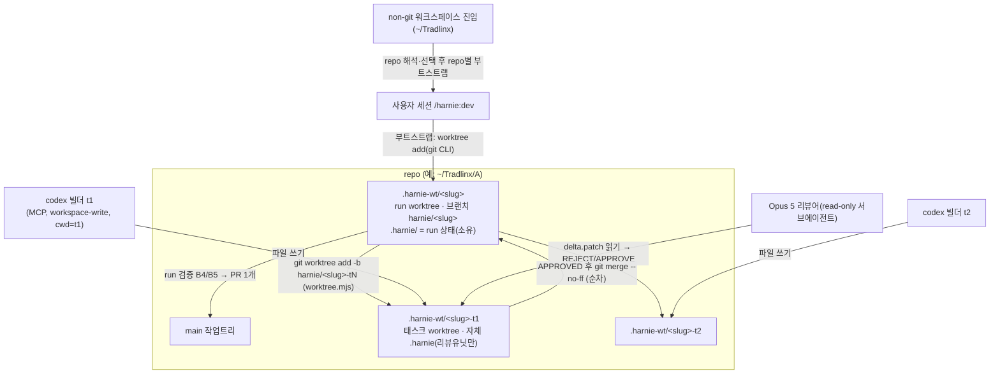
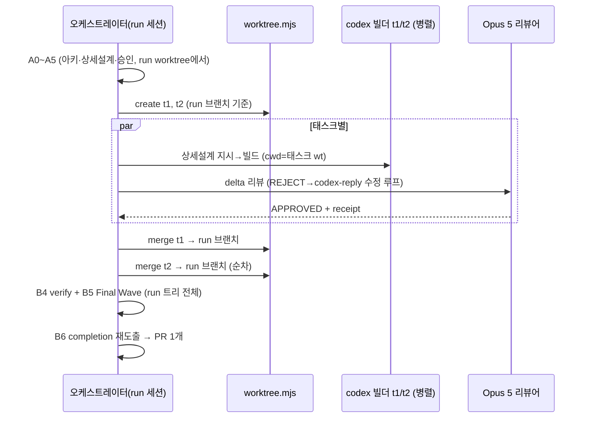

# harnie 병렬 개발·멀티레포·가드 슬림화 — 아키텍처 설계 (경량)

> 작성: 2026-08-13. 요구사항 R1~R7(사용자 제시) 기반. 사용자 결정 4건 반영:
> ① 태스크 통합 = run 브랜치 순차 merge(오케스트레이터가 충돌 해결, PR은 run당 1개)
> ② 가드 정리 = 공격적(핵심 4계층만 유지)
> ③ 루틴 이관 = 4종 전부 Codex 예약작업으로 일괄 이관
> ④ 병렬 세션 = Claude 세션 + codex 빌더(gpt-5.6-sol), 리뷰 = Opus 5

---

## 1. Executive Summary

harnie의 dev 워크플로는 현재 **repo당 활성 run 1개·단일 트리 직렬 빌드** 모델이고, 훅/가드는 위협모델 §0.1(실수하는 오케스트레이터 방지; 적대적 세션은 비목표)을 넘어서는 방어 계층(셸 lexer, 인터프리터 pinning, 중복플래그, 승인질문 정확바인딩, lock 토큰, park/resume 등)이 누적됐다.

**핵심 설계 결정:**
- **DEC-001 (worktree-per-run):** `/harnie:dev` 부트스트랩이 run마다 git worktree(`.harnie-wt/<slug>`, 브랜치 `harnie/<slug>`)를 만들고 run 상태(`.harnie/`)를 worktree 안에 둔다. `findRoot`가 가장 가까운 `.git`/`.harnie`에 바인딩되는 기존 구조 덕에 **"루트당 run 1개" 싱글턴 모델은 그대로 유지**되며, 동시성은 루트(=worktree)를 늘려서 얻는다. 상태 모델 개편 없음.
- **DEC-002 (멀티레포 = repo별 독립 run):** cross-repo run은 만들지 않는다(비목표). 엔진은 단일 repo 루트 전제를 유지하고, 진입점만 non-git 워크스페이스(예: `~/Tradlinx`)에서 대상 repo를 해석해 repo별로 run을 부트스트랩한다.
- **DEC-003 (태스크 병렬 빌드):** dev-full PHASE B에서 태스크별 worktree(`harnie/<slug>-t<n>`, run 브랜치 기준)를 만들어 태스크별 상세설계→빌드→코드리뷰를 병렬 수행하고, 오케스트레이터가 run 브랜치로 **순차 merge** 후 run 단위 검증(B4/B5)을 통과시킨다. 승인·manifest는 run 레벨 1개(A5 불변).
- **DEC-004 (가드 4계층으로 축소):** 유지 = ①승인 前 소스쓰기 차단 ②`.harnie` 권위파일 보호(단순 canonical containment) ③Stop 완료 재도출(+honest-INCOMPLETE 재진입) ④승인 게이트(AskUserQuestion 관찰). 제거 = 셸 lexer 기반 read-only 판정, 인터프리터/경로 pinning, 중복플래그·case-insensitive 방어, 승인질문 정확바인딩(arm 후 첫 승인응답 소비로 단순화), lock 토큰 기계(단순 lockfile로), park/resume(worktree가 대체), pending-route의 failed latch.
- **DEC-005 (루틴 이관 = 로컬 codex 예약 실행):** 4종 루틴을 ChatGPT 클라우드 태스크가 아닌 **로컬 `codex exec` + 스케줄러(launchd)** 로 이관한다. 이유: 루틴이 로컬 git 클론(`~/Tradlinx/{repo}`)과 로컬 상태파일을 읽어야 하며, MCP(Slack/ADO/Atlassian)는 codex `config.toml`에 동일 등록 가능.

**가장 큰 위험 3개:** (a) 가드 삭제가 load-bearing 검증을 함께 걷어낼 위험 → T1 리뷰를 Opus 5 고강도로, 핵심 4계층 회귀 테스트는 반드시 보존. (b) 순차 merge 시 충돌 해결이 리뷰를 우회하는 창 → merge 후 run 레벨 B4(verify)+B5(Final Wave)가 백스톱. (c) codex 예약 실행의 인증/커넥터 가용성 → 루틴별 카나리 1회 검증 전 Claude 루틴 중단 금지(단, 사용자 결정은 "일괄 이관"이므로 카나리 통과 즉시 전환).

## 2. 목표·범위·비목표·제약

- **목표:** 한 repo에서 동시 run ≥3 / 대형 작업의 태스크 병렬 빌드 / non-git 워크스페이스 진입 / 가드·상태 코드 대폭 축소 / 루틴 4종 codex 이관.
- **성공 지표:** 기존 검증 명령(`node --test scripts/*.test.mjs hooks/*.test.mjs`) 그린 + 동일 repo 2-run 동시 라이브 검증 + 태스크 2개 병렬 빌드 E2E + 루틴 4종 codex 카나리 각 1회 성공.
- **비목표:** cross-repo 단일 run, 분산 상태 프로토콜, 태스크 스케줄러/큐, 적대적 세션 방어, auto-continue.
- **제약:** 언어 정책(영문 정본 + `*-ko.md` 미러 동시 갱신), 위협모델 §0.1 유지, 플러그인 설치 경로(`${CLAUDE_PLUGIN_ROOT}`) 호환.

## 3. 핵심 요구사항

| ID | 내용 |
|---|---|
| FR-001 | run 부트스트랩 시 worktree+브랜치 생성, run 상태는 worktree 내 `.harnie/`. 동일 repo 동시 run ≥3 |
| FR-002 | cwd가 git repo가 아니면 하위 repo 목록 제시→선택→repo별 부트스트랩 (1..N개) |
| FR-003 | 멀티레포 작업 = repo별 독립 run (엔진 변경 없음) |
| FR-004 | dev-full 대형: 아키 설계→태스크 분해(비겹침 파일 스코프)→태스크별 상세설계+빌드+리뷰 병렬(worktree)→run 브랜치 순차 merge→run 검증→PR 1개 |
| FR-005 | 가드는 DEC-004의 4계층만. park/resume·route failed latch·lock 토큰·정확바인딩 제거 |
| FR-006 | resume = `active.json` 존재 시 adopt(단순화). "비켜두기"는 새 worktree run으로 대체 |
| FR-007 | 루틴 4종을 codex exec + launchd로 이관, 회사색은 `~/Tradlinx/ROUTINE-CONFIG.md` on-demand read 유지 |
| NFR-001 | 강제 계층 코드(guards.mjs+hooks+execution.mjs 상태기계) LOC ≥40% 감소 |
| NFR-002 | 핵심 4계층 회귀 테스트 보존, 전체 테스트 그린 |
| NFR-003 | 병렬 빌더 ≥3 동시(merge만 직렬) |
| NFR-004 | 루틴 이관 후 기존과 동작 동등(카나리로 확인) |

## 4. 대안 비교

| | A. worktree 다중 루트 + 단일 repo 엔진 (권장) | B. 워크스페이스 레벨 중앙 상태(.harnie를 ~/Tradlinx로 승격, cross-repo run) | C. harnie 무변경 + Claude Code 내장 worktree만 사용 |
|---|---|---|---|
| 구조 | 루트(=worktree) 복제로 동시성, 엔진 불변 | 글로벌 레지스트리 + repo 참조 모델 신설 | 세션 격리만, dev-full 내부는 여전히 직렬 |
| 요구충족 | R1~R3 전부 | R1~R3 + cross-repo run까지 | R1 부분(세션 단위), R3 미충족 |
| 복잡도/운영 | 낮음(worktree 헬퍼 1개 추가) | 높음(상태·훅·containment 전면 개편) | 최저 |
| 장애격리 | worktree별 완전 격리 | 중앙 상태 = 단일 오염점 | 세션별 격리 |
| R6(과설계 지양) | 부합 | 위배 | 부합하나 R3 포기 |

**A 채택.** B는 현 규모(1인+자동화)에 과잉이고 §0.1 밖 문제를 만든다. C는 R3(태스크 병렬)를 못 푼다.

## 5. 권장 아키텍처

- **데이터 소유권:** run 상태(`active.json`·manifest·plan.md·execution.json·notepad)는 **run worktree의 `.harnie/`가 단독 소유**. 태스크 worktree는 자기 리뷰 유닛(`.harnie/task/<n>/review/…`)만 소유하고, merge 시 receipt를 run `.harnie/`로 복사해 완료 재도출 입력에 편입. main 작업트리는 harnie 상태를 갖지 않는다.
- **worktree 규약:** 위치 `<repo>/.harnie-wt/<이름>`, 생성 시 `.git/info/exclude`에 `.harnie-wt/`·`.harnie/` 자동 등록(커밋 불필요). 브랜치 run=`harnie/<slug>`(분기점=사용자 현재 브랜치), 태스크=`harnie/<slug>-t<n>`(분기점=run 브랜치).
- **신규 `scripts/worktree.mjs` CLI 계약(태스크 간 인터페이스):**
  - `create --repo <abs> --branch <name> [--from <ref>]` → worktree 경로 stdout, exclude 등록 포함
  - `merge --repo <abs> --branch <name> --into <ref>` → ff 불가 시 `--no-ff` merge, 충돌 시 exit 3 + 충돌 파일 목록 stdout
  - `remove --repo <abs> --branch <name> [--keep-branch]`
- **동기/비동기:** 태스크 빌드·리뷰 = 병렬(비동기, 세션 내 병렬 codex 호출 또는 별도 세션). merge·run 검증 = 직렬(오케스트레이터 단독).

## 6. 핵심 시나리오

**정상 — 대형 작업 병렬 빌드:**

**실패 1 — merge 충돌:** `worktree.mjs merge` exit 3 → 오케스트레이터가 run worktree에서 충돌 해결 → **충돌 해결분은 리뷰를 안 거쳤으므로** 해결 커밋에 대해 CR 델타 리뷰 1회 재실행 → 이후 순차 merge 계속. run 레벨 B4/B5가 최종 백스톱.

**실패 2 — 태스크 스코프 이탈:** 태스크 delta에 선언 스코프 밖 파일 발견 → 해당 태스크 REJECT(스코프 축소 또는 오케스트레이터에 스코프 재협상 보고). 겹침이 사후 발견되면 뒤 태스크를 앞 태스크 merge 후 rebase하고 재리뷰.

## 7. 리스크·미결정

| 리스크 | 가능성/영향 | 완화 |
|---|---|---|
| 가드 삭제가 load-bearing 검증 동반 제거 | 중/높음 | 핵심 4계층 테스트 보존 목록을 T1 프롬프트에 명시, Opus 5 리뷰 REJECT-bias |
| worktree 안 훅 루트 탐색 엣지(중첩 `.git` 파일) | 중/중 | T2에 worktree 내 findRoot 단위테스트 필수 |
| codex 예약 실행의 MCP/인증 부재 | 중/높음 | T4는 카나리 1회 성공을 완료 조건으로; 실패 시 원인 보고 후 해당 루틴만 Claude 유지 |
| 순차 merge 창의 무리뷰 변경 | 낮음/중 | 충돌 해결분 델타 재리뷰 + run 검증 |

**[미결정]** (a) run 완료 후 worktree 자동 제거 여부(v1: 유지하고 사용자에게 정리 명령 안내) (b) dev-quick에도 worktree 적용 여부(v1: 미적용 — quick은 훅/상태 없는 경량 트랙 유지) (c) codex 예약 실행의 스케줄러가 launchd인지 codex 자체 스케줄 기능인지(T4에서 현물 확인 후 결정).

## 8. 모델 플랜 (R5 평가)

| 역할 | 모델 | 판단 |
|---|---|---|
| 개발(빌더) | **GPT-5.6 Sol** (codex MCP, workspace-write) | 적절. harnie의 크로스-모델 원칙(빌더≠리뷰어 벤더) 유지 |
| 코드리뷰 | **Opus 5** (read-only 서브에이전트, REJECT-bias) | 적절. 특히 T1(가드 삭제)은 고강도 필수 |
| 세션 오케스트레이터 | Sonnet 5 권장 | 라우팅·merge·프롬프트 수행이 주 업무라 Opus 불필요(비용 절감). 기본 모델이어도 무방 |
| 조사·간단 읽기 | gpt-5.6-luna (codex read-only) / 폴백 Haiku 서브에이전트 | 토큰 절약용 |

→ **제안 조합 그대로 승인, 변경 권고 없음.** 유일한 추가 권고: T1 리뷰만 effort 상향.

## 9. 태스크 분해 (병렬 세션용)

| 태스크 | 범위 | 소유 파일(비겹침 원칙) | 웨이브 |
|---|---|---|---|
| **T1 가드·상태 슬림화** (R4) | DEC-004 구현, resume/stop 단순화, 테스트 정리 | `scripts/guards.mjs`, `hooks/*.mjs`, `scripts/execution.mjs`(park/route-latch/lock/바인딩 제거부), `scripts/loop.mjs`(검증 슬림화), 해당 `*.test.mjs`, `instructions/loop.md(+-ko)` | 1 |
| **T2 worktree 엔진 + 멀티레포 진입** (R1·R2) | `worktree.mjs` 신설, 부트스트랩 worktree 통합, non-git cwd repo 해석 | `scripts/worktree.mjs(+test)`, `hooks/bootstrap.mjs`, `commands/dev.md(+-ko)`, `scripts/execution.mjs`(init 진입부만) | 1 (T1과 execution.mjs 충돌 가능 — merge 시 오케스트레이터 해결) |
| **T3 dev-full 병렬 PHASE B** (R3) | B1 분해 계약, 태스크별 상세설계→빌드→리뷰 병렬, 순차 merge 프로토콜 | `skills/dev-full/SKILL.md(+-ko)`, `instructions/review-loop-driver.md(+-ko)`, 필요 시 신규 `scripts/task.mjs` | 1 (worktree.mjs는 §5 계약에 대고 작성) |
| **T4 루틴 4종 codex 이관** (R7) | 4종 SKILL→codex 지침 변환, MCP 등록, 스케줄 등록, 카나리 | repo 밖: `~/.codex/`(또는 확인된 경로), `~/Tradlinx/routines-codex/`(신설), 기존 Claude 루틴 비활성화 | 1 (완전 독립) |

**통합(웨이브 2, 오케스트레이터 세션):** T1 → T2 → T3 순차 merge(충돌 해결) → 전체 테스트 → 라이브 검증(동시 2-run + 병렬 2-task E2E) → PR. T4는 별도 검증.
